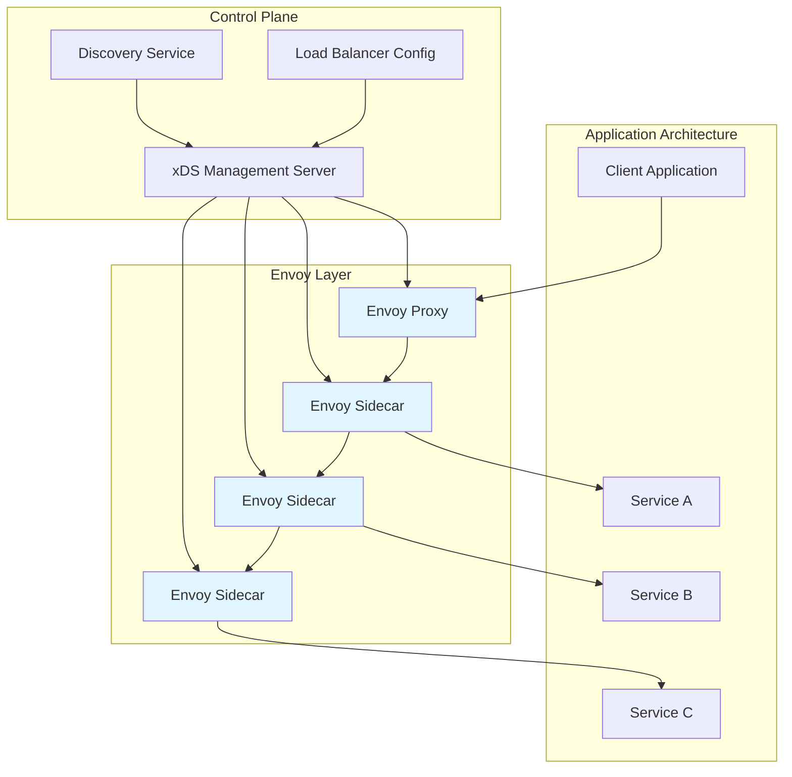
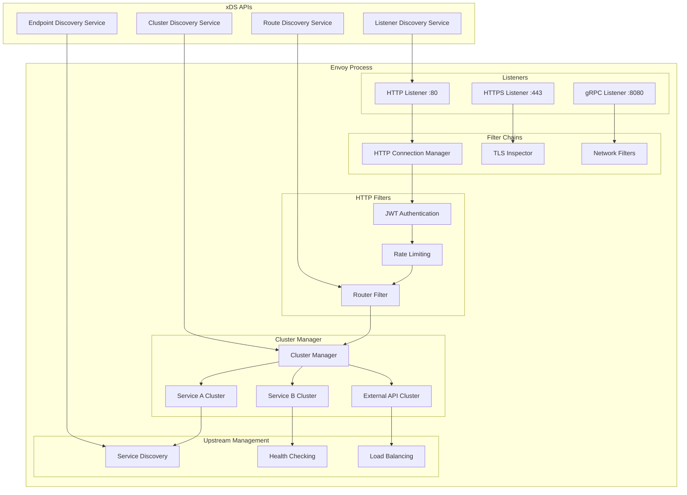
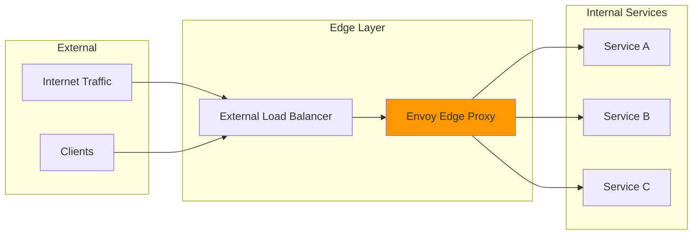
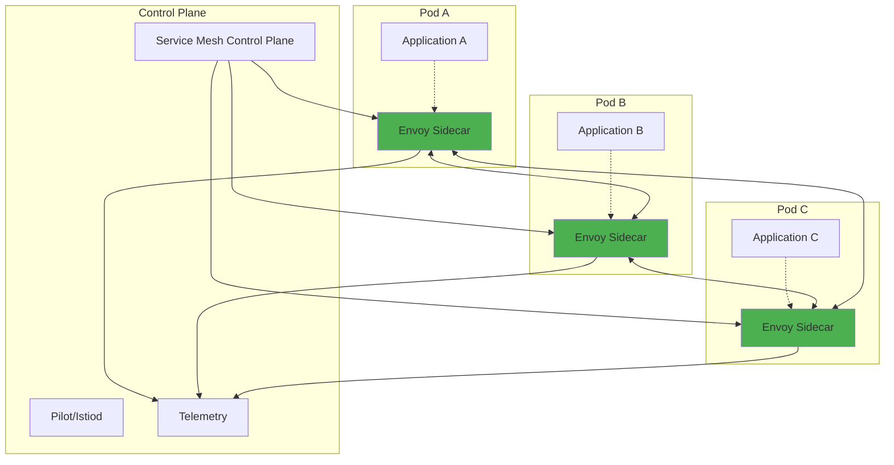
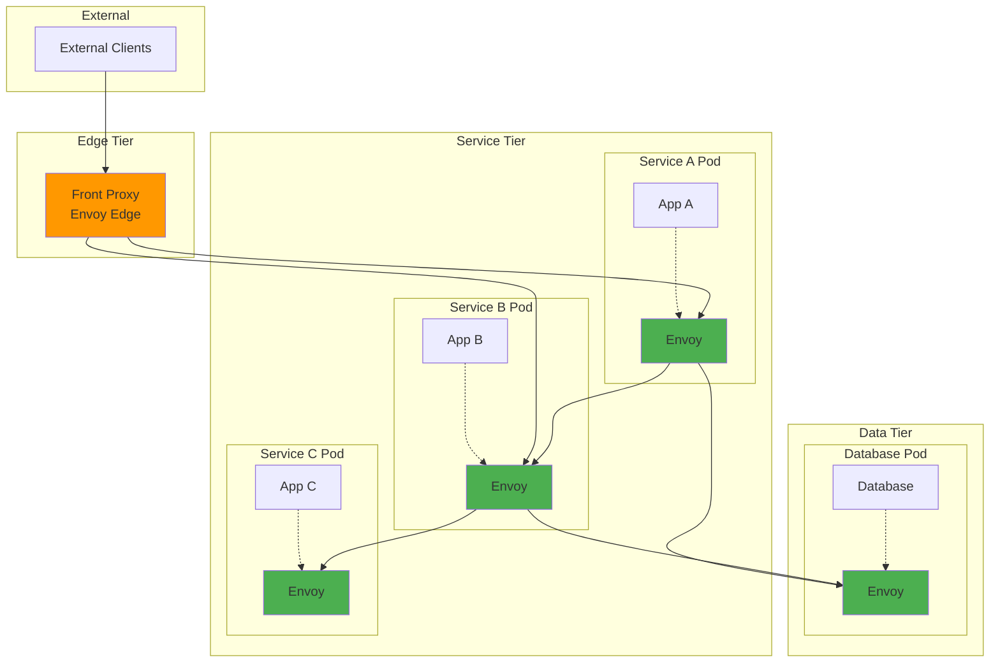
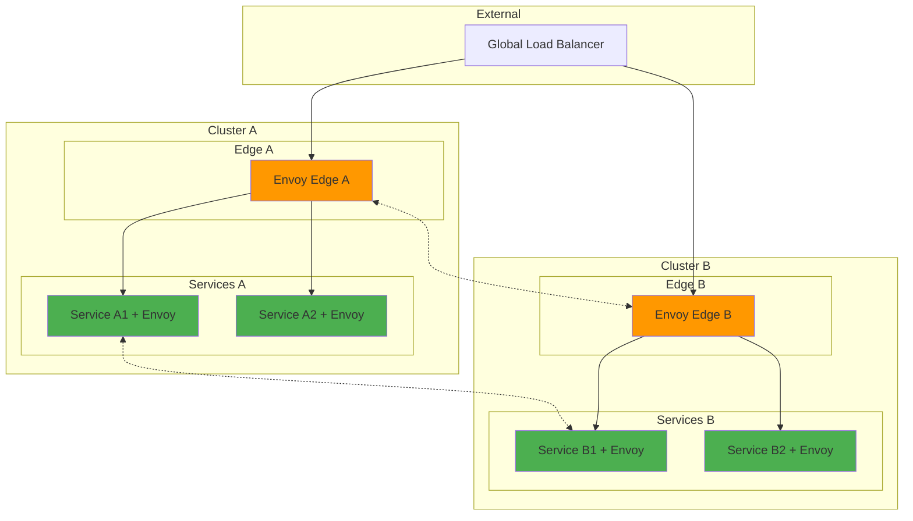
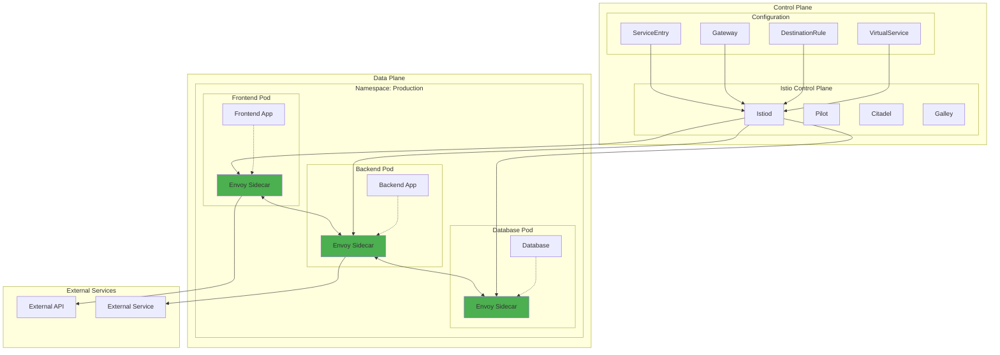
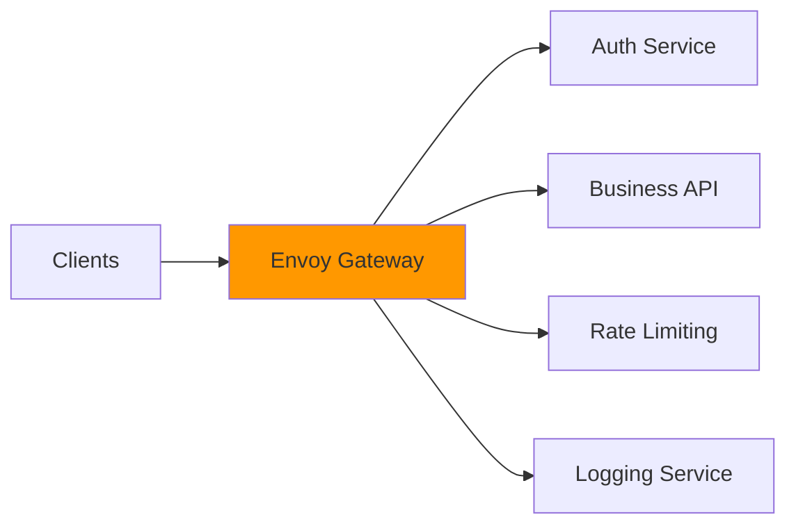
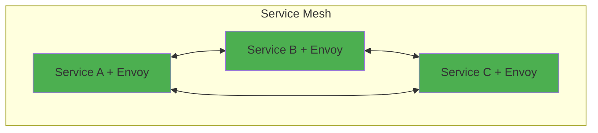
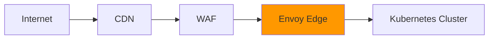

# Envoy Proxy: The Universal Data Plane

## Overview

Envoy Proxy is a high-performance, open-source edge and service proxy designed for cloud-native applications. Originally developed by Lyft and now a CNCF graduated project, Envoy has become the de facto standard data plane for modern service mesh architectures like Istio, Consul Connect, and AWS App Mesh.

This comprehensive guide explains Envoy's architecture, deployment patterns, and how it differs from traditional proxies, serving as both a learning resource and an index to more detailed documentation.

---

## Table of Contents

1. [What is Envoy Proxy?](#what-is-envoy-proxy)
2. [Envoy vs. Traditional Proxies](#envoy-vs-traditional-proxies)
3. [Core Architecture](#core-architecture)
4. [Deployment Patterns](#deployment-patterns)
5. [Envoy in Service Mesh](#envoy-in-service-mesh)
6. [Key Features and Capabilities](#key-features-and-capabilities)
7. [Use Cases and Benefits](#use-cases-and-benefits)
8. [Documentation Index](#documentation-index)

---

## What is Envoy Proxy?

### 🎯 Definition

**Envoy** is a Layer 7 (L7) proxy and communication bus designed for large, modern service-oriented architectures. It provides:

- **Universal data plane** for service mesh architectures
- **Dynamic configuration** via APIs (xDS protocol)
- **Advanced load balancing** with health checking
- **Observability** through metrics, logging, and tracing
- **Security** with TLS termination and authentication
- **Traffic management** with routing, fault injection, and circuit breaking

### 🏗️ High-Level Architecture



---

## Envoy vs. Traditional Proxies

### 📊 Comparison Matrix

| Feature | Traditional Proxies (nginx, HAProxy) | Envoy Proxy |
|---------|--------------------------------------|-------------|
| **Configuration** | Static files, reload required | Dynamic via xDS APIs |
| **Service Discovery** | Manual configuration | Automatic with multiple backends |
| **Health Checking** | Basic TCP/HTTP checks | Advanced with outlier detection |
| **Load Balancing** | Round-robin, least-conn | 15+ algorithms including ring hash |
| **Observability** | Basic logs and metrics | Rich metrics, distributed tracing |
| **Protocol Support** | HTTP/1.1, HTTP/2 | HTTP/1.1, HTTP/2, HTTP/3, gRPC, TCP |
| **Extensibility** | Modules (limited) | Filters and WASM extensions |
| **Cloud Native** | Adaptation required | Built for microservices |
| **Configuration Management** | File-based | API-driven, GitOps friendly |

### 🔍 Key Differentiators

**1. Dynamic Configuration**
- **Traditional**: Requires file changes and process restart
- **Envoy**: Hot-reload via xDS APIs without downtime

**2. Service Discovery Integration**
- **Traditional**: Static upstream definitions
- **Envoy**: Native integration with Kubernetes, Consul, EDS

**3. Observability by Design**
- **Traditional**: Basic logging and simple metrics
- **Envoy**: Rich telemetry with OpenTelemetry integration

**4. Protocol Awareness**
- **Traditional**: Primarily HTTP focus
- **Envoy**: Deep protocol understanding (gRPC, HTTP/2, etc.)

---

## Core Architecture

### 🏗️ Envoy Internal Architecture



### 🔧 Core Components

**1. Listeners**
- Bind to network interfaces and ports
- Accept incoming connections
- Apply filter chains to process traffic

**2. Filter Chains**
- Network filters (TCP-level processing)
- HTTP connection manager
- Custom filters for protocol handling

**3. HTTP Filters**
- Authentication and authorization
- Rate limiting and traffic shaping
- Request/response transformation
- Routing decisions

**4. Cluster Manager**
- Manages upstream service clusters
- Handles service discovery
- Implements load balancing algorithms

**5. xDS APIs**
- **LDS**: Listener Discovery Service
- **RDS**: Route Discovery Service  
- **CDS**: Cluster Discovery Service
- **EDS**: Endpoint Discovery Service

---

## Deployment Patterns

### 🚀 1. Edge Proxy (Gateway Pattern)



**Use Cases:**
- API Gateway functionality
- SSL/TLS termination
- Rate limiting and DDoS protection
- Authentication and authorization
- Request routing and load balancing

**Key Features:**
- Single entry point for external traffic
- Centralized security policies
- Global rate limiting
- Advanced routing (path, header-based)

### 🔄 2. Sidecar Proxy (Service Mesh Pattern)



**Use Cases:**
- Service-to-service communication
- Mutual TLS (mTLS) encryption
- Circuit breaking and retries
- Distributed tracing
- Traffic splitting and canary deployments

**Key Features:**
- Transparent to application code
- Automatic service discovery
- Security policy enforcement
- Rich observability

### 🌐 3. Front Proxy + Sidecar (Hybrid Pattern)



**Use Cases:**
- Complete ingress to egress traffic control
- Multi-tier application architectures
- End-to-end security and observability
- Comprehensive traffic management

### 🔗 4. Multi-Cluster (Double Proxy Pattern)



**Use Cases:**
- Multi-region deployments
- Cross-cluster service communication
- Disaster recovery and failover
- Global traffic management

---

## Envoy in Service Mesh

### 🕸️ Service Mesh Architecture



### 🔐 Service Mesh Benefits with Envoy

**1. Security**
- Automatic mutual TLS (mTLS)
- Certificate management and rotation
- RBAC and policy enforcement
- Security at the network edge and between services

**2. Observability**
- Distributed tracing (Jaeger, Zipkin)
- Metrics collection (Prometheus)
- Access logging and audit trails
- Service topology visualization

**3. Traffic Management**
- Intelligent routing and load balancing
- Circuit breaking and fault injection
- Canary deployments and blue-green
- Rate limiting and traffic shaping

**4. Reliability**
- Automatic retries and timeouts
- Outlier detection and ejection
- Health checking and failover
- Chaos engineering capabilities

---

## Key Features and Capabilities

### 🚀 Advanced Load Balancing

| Algorithm | Use Case | Description |
|-----------|----------|-------------|
| **Round Robin** | General purpose | Equal distribution across endpoints |
| **Least Request** | Variable latency | Route to endpoint with fewest active requests |
| **Ring Hash** | Session affinity | Consistent hashing for sticky sessions |
| **Random** | Simple scenarios | Random selection for basic load distribution |
| **Weighted** | Capacity-based | Route based on endpoint weights |
| **Locality Aware** | Multi-zone | Prefer endpoints in same zone/region |

### 📊 Observability Features

**Metrics Collection**
```yaml
# Example metrics exported by Envoy
envoy_cluster_upstream_rq_total
envoy_cluster_upstream_rq_time
envoy_http_downstream_rq_total
envoy_listener_downstream_cx_total
envoy_server_memory_allocated
```

**Distributed Tracing**
- OpenTelemetry integration
- Jaeger and Zipkin support
- Custom header propagation
- Sampling configuration

**Access Logging**
- Structured JSON logs
- Custom log formats
- Real-time streaming
- Integration with log aggregators

### 🔒 Security Capabilities

**TLS/SSL Features**
- TLS 1.2 and 1.3 support
- SNI (Server Name Indication)
- Certificate validation
- ALPN (Application-Layer Protocol Negotiation)

**Authentication & Authorization**
- JWT validation
- OAuth 2.0 integration
- External authorization service
- Role-based access control (RBAC)

### 🌐 Protocol Support

| Protocol | Support Level | Use Cases |
|----------|---------------|-----------|
| **HTTP/1.1** | Full | Legacy web applications |
| **HTTP/2** | Full | Modern web applications |
| **HTTP/3** | Experimental | Ultra-low latency applications |
| **gRPC** | Full | Microservices communication |
| **TCP** | Full | Database connections, custom protocols |
| **WebSocket** | Full | Real-time applications |
| **MongoDB** | Limited | Database proxy |
| **Redis** | Limited | Cache proxy |

---

## Use Cases and Benefits

### 🎯 Primary Use Cases

**1. API Gateway**


**2. Service Mesh Data Plane**


**3. Edge Proxy**


### 💡 Business Benefits

**Performance**
- Reduced latency through intelligent routing
- Connection pooling and HTTP/2 multiplexing
- Caching and compression
- Circuit breaking prevents cascade failures

**Security**
- Zero-trust networking
- Encryption in transit
- DDoS protection
- Security policy enforcement

**Operational Excellence**
- Simplified deployment and scaling
- Rich observability and debugging
- GitOps-friendly configuration
- Hot configuration updates

**Developer Productivity**
- Language-agnostic solution
- Simplified service communication
- Built-in reliability patterns
- Reduced boilerplate code

---

## Documentation Index

### 📚 Core Documentation

| Document | Purpose | Audience |
|----------|---------|----------|
| [Envoy Configuration Guide](./envoy-configuration.md) | Detailed configuration examples | DevOps Engineers |
| [xDS API Deep Dive](./envoy-xds-apis.md) | Dynamic configuration protocols | Platform Engineers |
| [Envoy Filters Guide](./envoy-filters.md) | HTTP and network filters | Developers |
| [Observability Setup](./envoy-observability.md) | Metrics, tracing, logging | SRE Teams |
| [Security Configuration](./envoy-security.md) | TLS, authentication, RBAC | Security Engineers |

### 🔧 Implementation Guides

| Document | Purpose | Audience |
|----------|---------|----------|
| [Istio + Envoy Integration](./istio-envoy-integration.md) | Service mesh implementation | Platform Teams |
| [Kubernetes Ingress with Envoy](./k8s-envoy-ingress.md) | Ingress controller setup | DevOps Engineers |
| [Multi-Cluster Setup](./envoy-multicluster.md) | Cross-cluster communication | Infrastructure Teams |
| [Performance Tuning](./envoy-performance.md) | Optimization and scaling | SRE Teams |
| [Troubleshooting Guide](./envoy-troubleshooting.md) | Common issues and solutions | Support Teams |

### 🚀 Advanced Topics

| Document | Purpose | Audience |
|----------|---------|----------|
| [Custom Filter Development](./envoy-custom-filters.md) | Building custom extensions | Advanced Developers |
| [WASM Extensions](./envoy-wasm.md) | WebAssembly-based extensions | Platform Engineers |
| [Rate Limiting Patterns](./envoy-rate-limiting.md) | Traffic control strategies | API Teams |
| [Canary Deployment Patterns](./envoy-canary.md) | Progressive delivery | DevOps Teams |
| [Chaos Engineering](./envoy-chaos.md) | Resilience testing | SRE Teams |

### 📊 Operations & Monitoring

| Document | Purpose | Audience |
|----------|---------|----------|
| [Metrics and Alerting](./envoy-metrics.md) | Monitoring setup | Operations Teams |
| [Log Analysis](./envoy-logs.md) | Log parsing and analysis | DevOps Engineers |
| [Distributed Tracing](./envoy-tracing.md) | End-to-end request tracking | Developers |
| [Capacity Planning](./envoy-capacity.md) | Resource planning | Infrastructure Teams |
| [Disaster Recovery](./envoy-dr.md) | Backup and recovery procedures | SRE Teams |

### 🔐 Security Documentation

| Document | Purpose | Audience |
|----------|---------|----------|
| [mTLS Configuration](./envoy-mtls.md) | Mutual TLS setup | Security Engineers |
| [JWT Authentication](./envoy-jwt.md) | Token-based auth | API Teams |
| [External Authorization](./envoy-ext-authz.md) | External auth integration | Security Teams |
| [Certificate Management](./envoy-certificates.md) | PKI and cert lifecycle | Infrastructure Teams |
| [Security Best Practices](./envoy-security-best-practices.md) | Security guidelines | All Teams |

### 🛠️ Development & Testing

| Document | Purpose | Audience |
|----------|---------|----------|
| [Local Development Setup](./envoy-local-dev.md) | Development environment | Developers |
| [Testing Strategies](./envoy-testing.md) | Unit and integration testing | QA Engineers |
| [Staging Environment](./envoy-staging.md) | Pre-production setup | DevOps Teams |
| [Migration Guide](./envoy-migration.md) | Legacy system migration | Platform Teams |
| [API Versioning](./envoy-api-versioning.md) | Version management | API Teams |

---

## Quick Start

### 🚀 Getting Started with Envoy

**1. Basic HTTP Proxy**
```yaml
# envoy.yaml
static_resources:
  listeners:
  - name: listener_0
    address:
      socket_address:
        address: 0.0.0.0
        port_value: 8080
    filter_chains:
    - filters:
      - name: envoy.filters.network.http_connection_manager
        typed_config:
          "@type": type.googleapis.com/envoy.extensions.filters.network.http_connection_manager.v3.HttpConnectionManager
          stat_prefix: ingress_http
          http_filters:
          - name: envoy.filters.http.router
          route_config:
            name: local_route
            virtual_hosts:
            - name: backend
              domains: ["*"]
              routes:
              - match:
                  prefix: "/"
                route:
                  cluster: backend_service
  clusters:
  - name: backend_service
    connect_timeout: 30s
    type: LOGICAL_DNS
    lb_policy: ROUND_ROBIN
    load_assignment:
      cluster_name: backend_service
      endpoints:
      - lb_endpoints:
        - endpoint:
            address:
              socket_address:
                address: httpbin.org
                port_value: 80
```

**2. Run Envoy**
```bash
docker run --rm -p 8080:8080 \
  -v $(pwd)/envoy.yaml:/etc/envoy/envoy.yaml \
  envoyproxy/envoy:v1.29-latest
```

**3. Test the Proxy**
```bash
curl http://localhost:8080/json
```

### 📈 Next Steps

1. **Explore Configuration**: Review the [Envoy Configuration Guide](./envoy-configuration.md)
2. **Set Up Observability**: Follow the [Observability Setup](./envoy-observability.md)
3. **Implement Security**: Configure TLS with [Security Configuration](./envoy-security.md)
4. **Deploy in Production**: Use [Kubernetes Ingress with Envoy](./k8s-envoy-ingress.md)
5. **Advanced Features**: Explore [Custom Filter Development](./envoy-custom-filters.md)

---

## Contributing

This documentation is part of the AKS-Istio learning repository. Contributions are welcome:

1. **Documentation Updates**: Submit PRs for improvements
2. **New Guides**: Add guides for specific use cases
3. **Examples**: Provide real-world configuration examples
4. **Feedback**: Open issues for clarifications or corrections

---

## Additional Resources

### 🔗 Official Links
- [Envoy Proxy Official Documentation](https://www.envoyproxy.io/)
- [Envoy GitHub Repository](https://github.com/envoyproxy/envoy)
- [CNCF Envoy Project](https://www.cncf.io/projects/envoy/)

### 📖 Community Resources
- [Christian Posta's Blog](https://blog.christianposta.com/)
- [Envoy Community Slack](https://envoyproxy.slack.com/)
- [Envoy Conferences and Talks](https://www.envoyproxy.io/community)

### 🎓 Training and Certification
- [Solo.io Envoy Training](https://www.solo.io/training/)
- [CNCF Cloud Native Training](https://training.cncf.io/)
- [Kubernetes and Service Mesh Courses](https://kubernetes.io/training/)

---

**Last Updated**: September 2025
**Maintainer**: AKS-Istio Documentation Team
**License**: MIT
