# Simple Envoy Static Configuration with Echo Service

## Overview

This guide demonstrates how to deploy Envoy Proxy with static configuration to route traffic to a backend echo service. You'll learn the fundamentals of Envoy listeners, routing, and cluster configuration while deploying a practical example in Kubernetes.

## 🚀 Quick Start Commands

For experienced users who want to run the complete setup quickly:

<details>
<summary>Click to expand complete command sequence</summary>

```bash
# 1. Cleanup (if needed)
kubectl delete deployment envoy-proxy echo-service --ignore-not-found=true
kubectl delete service envoy-proxy echo-service --ignore-not-found=true  
kubectl delete configmap envoy-config --ignore-not-found=true

# 2. Deploy echo service
kubectl apply -f - <<EOF
apiVersion: apps/v1
kind: Deployment
metadata:
  name: echo-service
  labels:
    app: echo-service
spec:
  replicas: 3
  selector:
    matchLabels:
      app: echo-service
  template:
    metadata:
      labels:
        app: echo-service
    spec:
      containers:
      - name: echo
        image: mendhak/http-https-echo:31
        ports:
        - containerPort: 8080
        env:
        - name: HTTP_PORT
          value: "8080"
---
apiVersion: v1
kind: Service
metadata:
  name: echo-service
  labels:
    app: echo-service
spec:
  selector:
    app: echo-service
  ports:
  - name: http
    port: 3000
    targetPort: 8080
  type: ClusterIP
EOF

# 3. Create Envoy config and deploy
cat > envoy-config.yaml <<EOF
apiVersion: v1
kind: ConfigMap
metadata:
  name: envoy-config
data:
  envoy.yaml: |
    static_resources:
      listeners:
      - name: listener_0
        address:
          socket_address:
            address: 0.0.0.0
            port_value: 8080
        filter_chains:
        - filters:
          - name: envoy.filters.network.http_connection_manager
            typed_config:
              '@type': type.googleapis.com/envoy.extensions.filters.network.http_connection_manager.v3.HttpConnectionManager
              stat_prefix: ingress_http
              route_config:
                name: local_route
                virtual_hosts:
                - name: backend
                  domains: ['*']
                  routes:
                  - match:
                      prefix: '/'
                    route:
                      cluster: echo_service
              http_filters:
              - name: envoy.filters.http.router
                typed_config:
                  '@type': type.googleapis.com/envoy.extensions.filters.http.router.v3.Router
      clusters:
      - name: echo_service
        connect_timeout: 5s
        type: STRICT_DNS
        lb_policy: ROUND_ROBIN
        load_assignment:
          cluster_name: echo_service
          endpoints:
          - lb_endpoints:
            - endpoint:
                address:
                  socket_address:
                    address: echo-service
                    port_value: 3000
        health_checks:
        - timeout: 1s
          interval: 10s
          unhealthy_threshold: 2
          healthy_threshold: 2
          http_health_check:
            path: "/"
            expected_statuses:
            - start: 200
              end: 299
    admin:
      address:
        socket_address:
          address: 0.0.0.0
          port_value: 9901
EOF

kubectl apply -f envoy-config.yaml

kubectl apply -f - <<EOF
apiVersion: apps/v1
kind: Deployment
metadata:
  name: envoy-proxy
spec:
  selector:
    matchLabels:
      app: envoy-proxy
  template:
    metadata:
      labels:
        app: envoy-proxy
    spec:
      containers:
      - name: envoy
        image: envoyproxy/envoy:v1.29-latest
        ports:
        - containerPort: 8080
        - containerPort: 9901
        volumeMounts:
        - name: envoy-config
          mountPath: /etc/envoy
        command: ["/usr/local/bin/envoy"]
        args: ["-c", "/etc/envoy/envoy.yaml"]
      volumes:
      - name: envoy-config
        configMap:
          name: envoy-config
---
apiVersion: v1
kind: Service
metadata:
  name: envoy-proxy
spec:
  selector:
    app: envoy-proxy
  ports:
  - name: http
    port: 8080
  - name: admin
    port: 9901
  type: LoadBalancer
EOF

# 4. Wait and test
kubectl wait --for=condition=ready pod -l app=envoy-proxy --timeout=120s
EXTERNAL_IP=$(kubectl get svc envoy-proxy -o jsonpath='{.status.loadBalancer.ingress[0].ip}')
echo "Testing Envoy at: http://$EXTERNAL_IP:8080"
curl -s http://$EXTERNAL_IP:8080/ | jq -r '.os.hostname'
```

</details>

## Learning Objectives

- Understand Envoy static configuration structure
- Learn how Envoy listeners work
- Configure routing to Kubernetes services
- Implement load balancing across multiple replicas
- Analyze traffic flow through architecture diagrams

---

## Prerequisites and Cleanup

### 🧹 Start Fresh (Recommended)

Before beginning this tutorial, run these cleanup commands to ensure a clean environment:

**Option 1: Use the provided cleanup script**
```bash
# Run the automated cleanup script
cd envoy/
chmod +x cleanup-envoy-demo.sh
./cleanup-envoy-demo.sh
```

**Option 2: Manual cleanup commands**
```bash
# Clean up any existing resources from previous runs
echo "🧹 Cleaning up existing resources..."

# Delete deployments
kubectl delete deployment envoy-proxy --ignore-not-found=true
kubectl delete deployment echo-service --ignore-not-found=true

# Delete services  
kubectl delete service envoy-proxy --ignore-not-found=true
kubectl delete service echo-service --ignore-not-found=true

# Delete configmaps
kubectl delete configmap envoy-config --ignore-not-found=true

# Delete any test pods
kubectl delete pods -l run=test-pod --ignore-not-found=true
kubectl delete pods -l run=debug --ignore-not-found=true

# Wait for cleanup to complete
echo "⏳ Waiting for cleanup to complete..."
sleep 10

# Verify cleanup
echo "✅ Verifying cleanup..."
kubectl get deployments,services,configmaps -l app=envoy-proxy
kubectl get deployments,services,configmaps -l app=echo-service

echo "🚀 Ready to start fresh!"
```

### 📋 Quick Test Environment Verification

```bash
# Verify kubectl connectivity
kubectl cluster-info

# Check available resources
kubectl get nodes
kubectl get namespaces

# Verify you're in the default namespace (or change as needed)
kubectl config view --minify --output 'jsonpath={..namespace}'
```

---

## Architecture Overview

```mermaid
graph TB
    subgraph "External Traffic"
        C[Client Requests]
        LB[Load Balancer IP]
    end
    
    subgraph "Kubernetes Cluster"
        subgraph "Envoy Deployment"
            E[Envoy Proxy<br/>:8080 → :3000]
        end
        
        subgraph "Echo Service Backend"
            ES[Echo Service<br/>ClusterIP]
            E1[Echo Pod 1<br/>:3000]
            E2[Echo Pod 2<br/>:3000] 
            E3[Echo Pod 3<br/>:3000]
        end
    end
    
    C --> LB
    LB --> E
    E --> ES
    ES --> E1
    ES --> E2
    ES --> E3
    
    style E fill:#e1f5fe,stroke:#01579b
    style ES fill:#f3e5f5,stroke:#4a148c
    style E1 fill:#e8f5e8,stroke:#2e7d32
    style E2 fill:#e8f5e8,stroke:#2e7d32
    style E3 fill:#e8f5e8,stroke:#2e7d32
```



### Traffic Flow

1. **Client Request** → Load Balancer IP (external)
2. **Load Balancer** → Envoy Proxy (port 8080)
3. **Envoy Proxy** → Echo Service (ClusterIP, port 3000)
4. **Echo Service** → Echo Pods (round-robin across 3 replicas)
5. **Response** flows back through the same path

---

## Step 1: Deploy Echo Service

First, let's deploy the echo service that will display all HTTP headers and request information.

```bash
# Deploy the echo service with 3 replicas
kubectl apply -f - <<EOF
apiVersion: apps/v1
kind: Deployment
metadata:
  name: echo-service
  labels:
    app: echo-service
spec:
  replicas: 3
  selector:
    matchLabels:
      app: echo-service
  template:
    metadata:
      labels:
        app: echo-service
    spec:
      containers:
      - name: echo
        image: mendhak/http-https-echo:31
        ports:
        - containerPort: 8080
          name: http
        env:
        - name: HTTP_PORT
          value: "8080"
        - name: HTTPS_PORT
          value: "8443"
---
apiVersion: v1
kind: Service
metadata:
  name: echo-service
  labels:
    app: echo-service
spec:
  selector:
    app: echo-service
  ports:
  - name: http
    port: 3000
    targetPort: 8080
    protocol: TCP
  type: ClusterIP
EOF
```

### Verify Echo Service Deployment

```bash
# Check pod status
kubectl get pods -l app=echo-service

# Check service
kubectl get svc echo-service

# Test the service internally
kubectl run test-pod --image=curlimages/curl:latest --rm -it --restart=Never -- \
  curl -s http://echo-service:3000/test
```

---

## Step 2: Create Envoy Static Configuration

Now we'll create Envoy configuration that routes traffic from port 8080 to our echo service.

```bash
# Create ConfigMap with Envoy static configuration
kubectl apply -f - <<EOF
apiVersion: v1
kind: ConfigMap
metadata:
  name: envoy-config
data:
  envoy.yaml: |
    static_resources:
      listeners:
      - name: listener_0
        address:
          socket_address:
            address: 0.0.0.0
            port_value: 8080
        filter_chains:
        - filters:
          - name: envoy.filters.network.http_connection_manager
            typed_config:
              "@type": type.googleapis.com/envoy.extensions.filters.network.http_connection_manager.v3.HttpConnectionManager
              stat_prefix: ingress_http
              access_log:
              - name: envoy.access_loggers.stdout
                typed_config:
                  "@type": type.googleapis.com/envoy.extensions.access_loggers.stream.v3.StdoutAccessLog
                  log_format:
                    text_format: |
                      [%START_TIME%] "%REQ(:METHOD)% %REQ(X-ENVOY-ORIGINAL-PATH?:PATH)% %PROTOCOL%"
                      %RESPONSE_CODE% %RESPONSE_FLAGS% %BYTES_RECEIVED% %BYTES_SENT%
                      %DURATION% %RESP(X-ENVOY-UPSTREAM-SERVICE-TIME)% "%REQ(X-FORWARDED-FOR)%"
                      "%REQ(USER-AGENT)%" "%REQ(X-REQUEST-ID)%" "%REQ(:AUTHORITY)%"
                      "%UPSTREAM_HOST%" %UPSTREAM_CLUSTER%
              http_filters:
              - name: envoy.filters.http.router
                typed_config:
                  "@type": type.googleapis.com/envoy.extensions.filters.http.router.v3.Router
              route_config:
                name: local_route
                virtual_hosts:
                - name: echo_service
                  domains: ["*"]
                  routes:
                  - match:
                      prefix: "/"
                    route:
                      cluster: echo_cluster
                      timeout: 30s
                    request_headers_to_add:
                    - header:
                        key: "x-envoy-proxy"
                        value: "simple-envoy"
                    - header:
                        key: "x-forwarded-by"
                        value: "envoy-proxy"

      clusters:
      - name: echo_cluster
        connect_timeout: 5s
        type: STRICT_DNS
        lb_policy: ROUND_ROBIN
        health_checks:
        - timeout: 1s
          interval: 10s
          unhealthy_threshold: 2
          healthy_threshold: 2
          http_health_check:
            path: "/"
            expected_statuses:
            - start: 200
              end: 299
        load_assignment:
          cluster_name: echo_cluster
          endpoints:
          - lb_endpoints:
            - endpoint:
                address:
                  socket_address:
                    address: echo-service
                    port_value: 3000

    admin:
      address:
        socket_address:
          address: 0.0.0.0
          port_value: 9901
EOF
```

---

## Step 3: Deploy Envoy Proxy

Deploy Envoy using the static configuration we created above.

```bash
# Deploy Envoy proxy
kubectl apply -f - <<EOF
apiVersion: apps/v1
kind: Deployment
metadata:
  name: envoy-proxy
  labels:
    app: envoy-proxy
spec:
  replicas: 1
  selector:
    matchLabels:
      app: envoy-proxy
  template:
    metadata:
      labels:
        app: envoy-proxy
    spec:
      containers:
      - name: envoy
        image: envoyproxy/envoy:v1.29-latest
        ports:
        - containerPort: 8080
          name: http
        - containerPort: 9901
          name: admin
        volumeMounts:
        - name: envoy-config
          mountPath: /etc/envoy
          readOnly: true
        command:
        - /usr/local/bin/envoy
        args:
        - -c
        - /etc/envoy/envoy.yaml
        - --service-cluster
        - envoy-proxy
        - --service-node
        - envoy-proxy
        - --log-level
        - info
        resources:
          requests:
            memory: "128Mi"
            cpu: "100m"
          limits:
            memory: "256Mi"
            cpu: "200m"
        livenessProbe:
          httpGet:
            path: /ready
            port: 9901
          initialDelaySeconds: 30
          periodSeconds: 10
        readinessProbe:
          httpGet:
            path: /ready
            port: 9901
          initialDelaySeconds: 5
          periodSeconds: 5
      volumes:
      - name: envoy-config
        configMap:
          name: envoy-config
---
apiVersion: v1
kind: Service
metadata:
  name: envoy-proxy
  labels:
    app: envoy-proxy
spec:
  selector:
    app: envoy-proxy
  ports:
  - name: http
    port: 8080
    targetPort: 8080
    protocol: TCP
  - name: admin
    port: 9901
    targetPort: 9901
    protocol: TCP
  type: LoadBalancer
EOF
```

---

## Step 4: Verify Deployment

### Check All Resources

```bash
# Check all pods
kubectl get pods -l app=echo-service
kubectl get pods -l app=envoy-proxy

# Check services
kubectl get svc echo-service
kubectl get svc envoy-proxy

# Check configmap
kubectl get configmap envoy-config
```

### Get Load Balancer IP

```bash
# Wait for external IP assignment
kubectl get svc envoy-proxy -w

# Once IP is assigned, get it
ENVOY_LB_IP=$(kubectl get svc envoy-proxy -o jsonpath='{.status.loadBalancer.ingress[0].ip}')
echo "Envoy Load Balancer IP: $ENVOY_LB_IP"
```

---

## Step 5: Test the Setup

### Basic Connectivity Test

```bash
# Test basic connectivity
curl -v http://$ENVOY_LB_IP:8080/

# Test with custom headers
curl -H "X-Custom-Header: test-value" \
     -H "User-Agent: envoy-test-client" \
     http://$ENVOY_LB_IP:8080/api/test

# Test multiple requests to see load balancing
for i in {1..6}; do
  echo "Request $i:"
  curl -s http://$ENVOY_LB_IP:8080/ | grep -E "(hostname|pod)"
  echo "---"
done
```

### Analyze Response Headers

```bash
# Check what headers Envoy adds
curl -v http://$ENVOY_LB_IP:8080/ 2>&1 | grep -E "(^>|^<)"

# Get detailed response with all headers
curl -s http://$ENVOY_LB_IP:8080/ | jq '.'
```

---

## Step 6: Envoy Admin Interface

Access Envoy's admin interface to see configuration and statistics.

```bash
# Port forward to admin interface
kubectl port-forward svc/envoy-proxy 9901:9901 &

# View cluster status
curl http://localhost:9901/clusters

# View configuration dump
curl http://localhost:9901/config_dump

# View statistics
curl http://localhost:9901/stats

# View health check status
curl http://localhost:9901/clusters?format=json | jq '.cluster_statuses[0].host_statuses'

# Stop port forwarding
pkill -f "kubectl port-forward"
```

---

## Understanding the Configuration

### 🎯 Key Configuration Components

**1. Listener Configuration**
```yaml
listeners:
- name: listener_0
  address:
    socket_address:
      address: 0.0.0.0    # Listen on all interfaces
      port_value: 8080     # Incoming traffic port
```

**2. HTTP Connection Manager**
```yaml
filter_chains:
- filters:
  - name: envoy.filters.network.http_connection_manager
    # Handles HTTP protocol processing
    # Manages routing, headers, logging
```

**3. Route Configuration**
```yaml
route_config:
  virtual_hosts:
  - name: echo_service
    domains: ["*"]       # Accept all domains
    routes:
    - match:
        prefix: "/"      # Match all paths
      route:
        cluster: echo_cluster
```

**4. Cluster Definition**
```yaml
clusters:
- name: echo_cluster
  type: STRICT_DNS       # Use DNS for service discovery
  lb_policy: ROUND_ROBIN # Load balancing algorithm
  load_assignment:
    endpoints:
    - lb_endpoints:
      - endpoint:
          address:
            socket_address:
              address: echo-service  # Kubernetes service name
              port_value: 3000
```

### 📊 Configuration Analysis

| Component | Purpose | Key Settings |
|-----------|---------|--------------|
| **Listener** | Accept incoming connections | Port 8080, all interfaces |
| **HTTP Connection Manager** | Process HTTP requests | Routing, logging, filters |
| **Virtual Host** | Define routing rules | Domain matching, path routing |
| **Cluster** | Define backend services | DNS resolution, load balancing |
| **Health Checks** | Monitor backend health | HTTP health checks on `/health` |

---

## Load Balancing Verification

### Test Load Distribution

```bash
# Create a script to test load balancing
cat > test-load-balancing.sh << 'EOF'
#!/bin/bash

ENVOY_LB_IP=$(kubectl get svc envoy-proxy -o jsonpath='{.status.loadBalancer.ingress[0].ip}')

echo "Testing load balancing across echo service replicas..."
echo "Envoy LB IP: $ENVOY_LB_IP"
echo "=================================================="

for i in {1..12}; do
  echo -n "Request $i: "
  response=$(curl -s http://$ENVOY_LB_IP:8080/ | jq -r '.environment.HOSTNAME // "unknown"')
  echo "Pod: $response"
  sleep 0.5
done

echo ""
echo "Summary of pod distribution:"
for i in {1..12}; do
  curl -s http://$ENVOY_LB_IP:8080/ | jq -r '.environment.HOSTNAME // "unknown"'
done | sort | uniq -c
EOF

chmod +x test-load-balancing.sh
./test-load-balancing.sh
```

### Expected Output
```
Testing load balancing across echo service replicas...
================================================== 
Request 1: Pod: echo-service-abc123
Request 2: Pod: echo-service-def456  
Request 3: Pod: echo-service-ghi789
Request 4: Pod: echo-service-abc123
...

Summary of pod distribution:
      4 echo-service-abc123
      4 echo-service-def456  
      4 echo-service-ghi789
```

---

## Monitoring and Observability

### View Envoy Logs

```bash
# Follow Envoy access logs
kubectl logs -f deployment/envoy-proxy -c envoy

# View last 50 log entries
kubectl logs --tail=50 deployment/envoy-proxy -c envoy
```

### Monitor Echo Service

```bash
# View echo service logs
kubectl logs -f deployment/echo-service

# Check individual pod logs
kubectl get pods -l app=echo-service
kubectl logs echo-service-<pod-id>
```

### Statistics and Metrics

```bash
# Get cluster statistics
kubectl exec deployment/envoy-proxy -c envoy -- \
  curl -s localhost:9901/stats | grep cluster.echo_cluster

# Get listener statistics  
kubectl exec deployment/envoy-proxy -c envoy -- \
  curl -s localhost:9901/stats | grep listener.0.0.0.0_8080

# Get HTTP connection manager stats
kubectl exec deployment/envoy-proxy -c envoy -- \
  curl -s localhost:9901/stats | grep http.ingress_http
```

---

## Troubleshooting

### Common Issues and Solutions

**1. Service Not Accessible**
```bash
# Check if pods are running
kubectl get pods -l app=echo-service
kubectl get pods -l app=envoy-proxy

# Check service endpoints
kubectl get endpoints echo-service
kubectl get endpoints envoy-proxy

# Test internal connectivity
kubectl run debug --image=curlimages/curl:latest --rm -it --restart=Never -- \
  curl -v http://echo-service:3000/
```

**2. Envoy Configuration Issues**
```bash
# Check configmap
kubectl describe configmap envoy-config

# Check Envoy logs for configuration errors
kubectl logs deployment/envoy-proxy -c envoy | grep -i error

# Validate configuration
kubectl exec deployment/envoy-proxy -c envoy -- \
  curl -s localhost:9901/config_dump | jq '.configs[0].dynamic_listeners'
```

**3. Load Balancer IP Not Assigned**
```bash
# Check service status
kubectl describe svc envoy-proxy

# Check cloud provider load balancer
kubectl get events --field-selector involvedObject.name=envoy-proxy

# Use NodePort as alternative
kubectl patch svc envoy-proxy -p '{"spec":{"type":"NodePort"}}'
```

### Health Check Verification

```bash
# Check cluster health from Envoy admin
kubectl exec deployment/envoy-proxy -c envoy -- \
  curl -s localhost:9901/clusters | grep echo_cluster

# Expected output should show healthy endpoints:
# echo_cluster::echo-service:3000::health_flags::/healthy
```

---

## Configuration Variations

### 1. Add Request/Response Headers

```yaml
# Add to route configuration
routes:
- match:
    prefix: "/"
  route:
    cluster: echo_cluster
  request_headers_to_add:
  - header:
      key: "x-envoy-proxy"
      value: "simple-envoy"
  - header:
      key: "x-request-time"
      value: "%START_TIME%"
  response_headers_to_add:
  - header:
      key: "x-processed-by"
      value: "envoy-proxy"
```

### 2. Path-based Routing

```yaml
# Multiple routes example
routes:
- match:
    prefix: "/api/"
  route:
    cluster: echo_cluster
    prefix_rewrite: "/"
- match:
    prefix: "/health"
  route:
    cluster: echo_cluster
- match:
    prefix: "/"
  route:
    cluster: echo_cluster
```

### 3. Different Load Balancing Algorithms

```yaml
# Change in cluster configuration
clusters:
- name: echo_cluster
  lb_policy: LEAST_REQUEST  # Options: ROUND_ROBIN, LEAST_REQUEST, RANDOM, RING_HASH
```

---

## Clean Up

**Option 1: Use the automated cleanup script**
```bash
# Run the comprehensive cleanup script
./cleanup-envoy-demo.sh
```

**Option 2: Manual cleanup**
```bash
# Remove all resources manually
kubectl delete deployment envoy-proxy echo-service
kubectl delete service envoy-proxy echo-service
kubectl delete configmap envoy-config

# Clean up any test pods
kubectl delete pods -l run=test-pod --ignore-not-found=true
kubectl delete pods -l run=debug --ignore-not-found=true

# Verify cleanup
kubectl get all -l app=envoy-proxy
kubectl get all -l app=echo-service
```

**Option 3: Reset everything (nuclear option)**
```bash
# If you want to start completely fresh in a test cluster
kubectl delete all --all -n default
kubectl delete configmaps --all -n default
```

---

## Key Takeaways

### ✅ What You Learned

1. **Envoy Static Configuration Structure**
   - Listeners define where Envoy accepts traffic
   - Routes determine how to forward requests
   - Clusters define backend services and load balancing

2. **Kubernetes Integration**
   - Service discovery using DNS names
   - ConfigMaps for configuration management
   - LoadBalancer services for external access

3. **Load Balancing**
   - Round-robin distribution across replicas
   - Health checking for backend availability
   - Connection pooling and timeouts

4. **Observability**
   - Access logging for request tracking
   - Admin interface for monitoring
   - Statistics and metrics collection

## 🧪 Testing and Validation

### Basic Testing

1. **Get the external IP of the Envoy service:**
   ```bash
   kubectl get svc envoy-proxy
   ```

2. **Test the echo service through Envoy:**
   ```bash
   curl http://EXTERNAL_IP:8080/
   ```

3. **Test load balancing by making multiple requests:**
   ```bash
   for i in {1..5}; do 
     echo "Request $i:"
     curl -s http://EXTERNAL_IP:8080/ | jq -r '.os.hostname'
     echo
   done
   ```

4. **Check Envoy admin interface:**
   ```bash
   # View cluster status
   curl http://EXTERNAL_IP:9901/clusters
   
   # View statistics
   curl http://EXTERNAL_IP:9901/stats
   
   # View configuration dump
   curl http://EXTERNAL_IP:9901/config_dump
   ```

### Expected Results

- **Echo Service Response**: You should see JSON output showing request headers, including Envoy-added headers like `x-request-id` and `x-envoy-expected-rq-timeout-ms`
- **Load Balancing**: Multiple requests should show different `hostname` values, indicating traffic is being distributed across the 3 echo service replicas
- **Admin Interface**: Should show healthy cluster status and routing statistics

## 🔧 Troubleshooting

### Common Issues and Solutions

#### 1. Envoy pods in CrashLoopBackOff
**Symptom:** Pods fail to start with configuration errors

**Check logs:**
```bash
kubectl logs -l app=envoy-proxy
```

**Common causes and solutions:**
- **Invalid health check configuration**
  - Error: "Invalid http expected status range: expecting start < end"
  - Solution: Use proper range format:
  ```yaml
  expected_statuses:
  - start: 200
    end: 299
  ```

- **Port mismatches between services**
  - Check service port: `kubectl get svc echo-service -o yaml`
  - Ensure Envoy cluster configuration uses correct port

- **Malformed YAML in ConfigMap**
  - Validate YAML syntax
  - Check for proper escaping of quotes in kubectl commands

#### 2. Connection Timeout/Upstream Connect Error
**Symptom:** "upstream connect error or disconnect/reset before headers"

**Debug steps:**
```bash
# Check if target service is running
kubectl get pods -l app=echo-service

# Check service port configuration  
kubectl get svc echo-service -o yaml

# Test direct service connectivity
kubectl run test-pod --image=nginx --rm -it -- curl http://echo-service:3000/

# Check Envoy cluster configuration
curl http://EXTERNAL_IP:9901/clusters | grep echo_service
```

**Common causes:**
- Wrong service name in cluster configuration
- Port mismatch between Envoy config and service
- Service not running or unhealthy
- Network policies blocking traffic

#### 3. Service Discovery Issues
**Symptoms:** DNS resolution failures, "no healthy upstream" errors

**Solutions:**
- Ensure service names match exactly in Envoy configuration
- Verify services are in the same namespace
- Check DNS resolution: `kubectl run test-pod --image=nginx --rm -it -- nslookup echo-service`

#### 4. Load Balancing Not Working
**Symptoms:** All requests go to same pod

**Check:**
- Verify multiple replicas are running: `kubectl get pods -l app=echo-service`
- Check Envoy load balancing policy in configuration
- Review health check status: `curl http://EXTERNAL_IP:9901/clusters`

### Configuration Best Practices

1. **Health Checks:**
   - Use appropriate endpoints that return 2xx status codes
   - Set reasonable timeout and interval values (consider app startup time)
   - Use path that doesn't require authentication

2. **Load Balancing:**
   - Choose appropriate policy (ROUND_ROBIN for simplicity, LEAST_REQUEST for performance)
   - Configure circuit breakers for resilience
   - Set proper connection timeouts

3. **Monitoring:**
   - Always enable Envoy admin interface for debugging
   - Use Envoy's built-in metrics for monitoring
   - Configure appropriate logging levels

4. **Security:**
   - Restrict admin interface access in production
   - Use proper network policies
   - Consider TLS for sensitive traffic

### 🚀 Next Steps

1. **Dynamic Configuration**: Learn about xDS APIs for dynamic updates
2. **Security**: Add TLS termination and authentication
3. **Advanced Routing**: Implement header-based and weighted routing
4. **Service Mesh**: Integrate with Istio for full service mesh capabilities
5. **Monitoring**: Set up Prometheus metrics and Grafana dashboards

### 📖 Related Documentation

- [Envoy Configuration Guide](./envoy-configuration.md)
- [xDS API Deep Dive](./envoy-xds-apis.md)
- [Istio Integration](./istio-envoy-integration.md)
- [Advanced Routing Patterns](./envoy-advanced-routing.md)

---

**Congratulations!** You've successfully deployed Envoy Proxy with static configuration and learned the fundamentals of how Envoy routes traffic to Kubernetes services. This foundation will help you understand more complex Envoy deployments and service mesh architectures.
