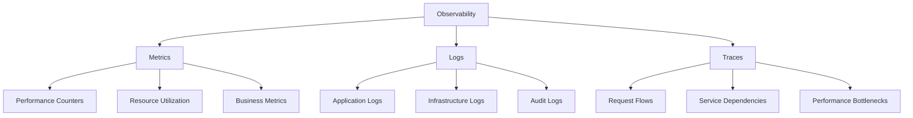
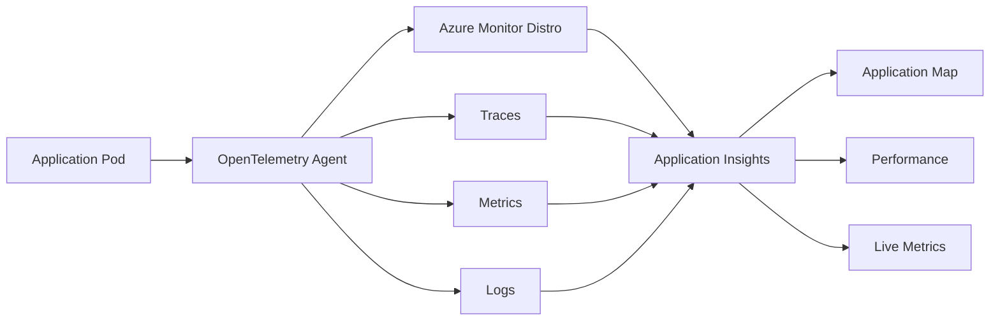
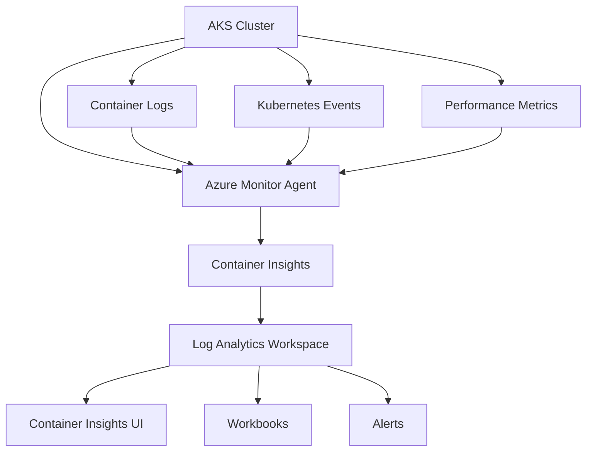
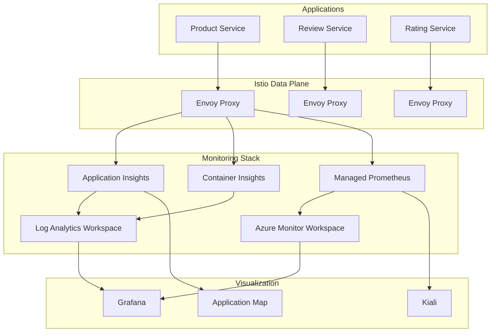
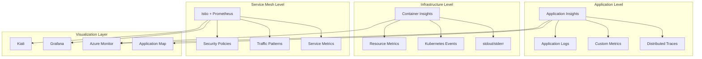
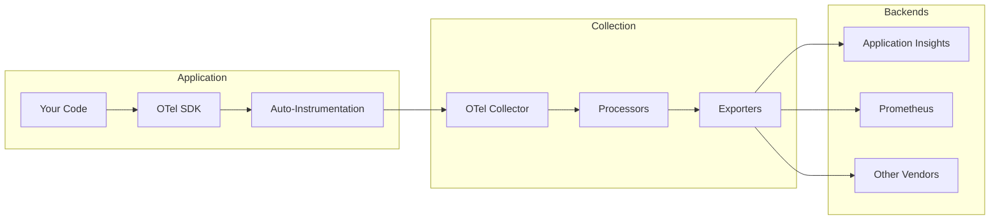
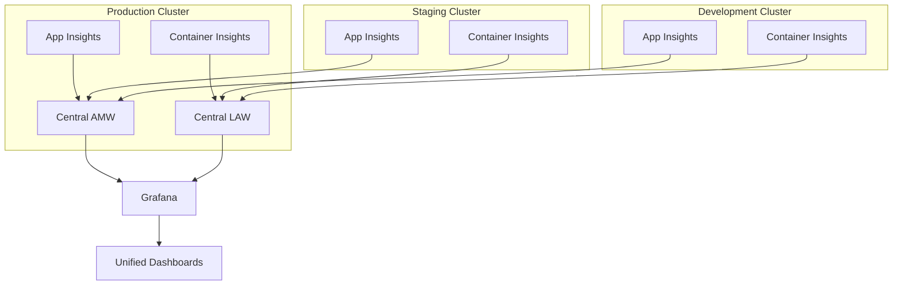

# Azure Monitoring Stack with Istio: Application Insights vs Container Insights

**TESTING-IN-PROGRESS**

## Overview

This comprehensive guide explains the distinct roles of **Application Insights** and **Container Insights** in the Azure monitoring ecosystem, specifically in the context of Istio service mesh. You'll learn how these services complement each other, their integration with OpenTelemetry, and how they work alongside Prometheus, Grafana, and Kiali for complete observability.

## Learning Objectives

By the end of this lab, you will understand:

1. **Distinct Roles**: The fundamental differences between Application Insights (tracing) and Container Insights (logging)
2. **OpenTelemetry Integration**: How OpenTelemetry standardizes telemetry collection across services
3. **Monitoring Stack**: Complete observability architecture with Prometheus, Grafana, Kiali, and Azure Monitor
4. **Practical Implementation**: Hands-on examples showing each service in action
5. **Data Flow**: How telemetry flows through the entire monitoring stack

---

## Part 1: Understanding the Monitoring Landscape

### 🎯 The Three Pillars of Observability

Modern observability is built on three fundamental pillars:



### 🔍 Service Comparison Matrix

| Service | Primary Purpose | Data Type | Storage | Query Language | Best For |
|---------|----------------|-----------|---------|----------------|----------|
| **Application Insights** | Application Performance Monitoring | Traces, Metrics, Logs | Azure Monitor Logs | KQL/PromQL | Distributed tracing, application performance |
| **Container Insights** | Infrastructure & Container Monitoring | Logs, Basic Metrics | Log Analytics | KQL | Container logs, stdout/stderr, infrastructure |
| **Managed Prometheus** | Metrics Collection | Time-series Metrics | Azure Monitor Workspace | PromQL | Performance metrics, alerting |
| **Grafana** | Visualization | Dashboard/Queries | N/A (Query Layer) | PromQL/KQL | Metrics visualization, dashboards |
| **Kiali** | Service Mesh Visualization | Istio Config + Metrics | N/A (Query Layer) | Istio APIs | Service topology, traffic flow |

---

## Part 2: Application Insights - The Tracing Powerhouse

### 🎯 Core Purpose: Application Performance Monitoring (APM)

Application Insights is designed for **deep application observability** through:

- **Distributed Tracing**: Follow requests across microservices
- **Dependency Mapping**: Automatic discovery of service relationships  
- **Performance Analytics**: Response times, failure rates, user flows
- **Live Metrics**: Real-time application performance monitoring

### 🔧 How It Works with OpenTelemetry

```yaml
# Application Insights with OpenTelemetry Auto-instrumentation
apiVersion: monitor.azure.com/v1
kind: Instrumentation
metadata:
  name: default
  namespace: bookinfo
spec:
  settings:
    autoInstrumentationPlatforms: ["java", "nodejs", "python", "dotnet"]
  destination:
    applicationInsightsConnectionString: "InstrumentationKey=xxxx..."
```

### 📊 Data Collection Architecture



### 🚀 Key Capabilities

1. **Automatic Instrumentation**: Zero-code changes required
2. **Cross-Service Correlation**: Track requests across service boundaries
3. **Dependency Analysis**: Understand service relationships
4. **Custom Telemetry**: Add business-specific metrics and events

---

## Part 3: Container Insights - The Infrastructure Logger

### 🎯 Core Purpose: Infrastructure & Container Monitoring

Container Insights focuses on **platform-level observability**:

- **Container Logs**: stdout/stderr from all containers
- **Infrastructure Metrics**: CPU, memory, network, storage
- **Kubernetes Events**: Pod lifecycle, deployments, scaling
- **Node Health**: Worker node status and resource utilization

### 🔧 How It Works



### 📊 Data Types Collected

1. **Container Logs** (`ContainerLog` table)
   - Application stdout/stderr
   - System container logs
   - Init container outputs

2. **Performance Data** (`Perf` table) 
   - CPU and memory utilization
   - Network I/O statistics
   - Disk usage metrics

3. **Kubernetes Events** (`KubeEvents` table)
   - Pod creation/deletion
   - Scaling events
   - Configuration changes

---

## Part 4: The Complete Observability Stack

### 🏗️ Architecture Overview



### 🔄 Data Flow Explanation

1. **Applications** run in Istio-enabled pods with Envoy sidecars
2. **OpenTelemetry** auto-instrumentation captures traces → **Application Insights**
3. **Container logs** (stdout/stderr) → **Container Insights** → **Log Analytics**
4. **Istio metrics** → **Managed Prometheus** → **Azure Monitor Workspace**
5. **Visualization** through Grafana, Kiali, and Application Insights UX

---

## Part 5: Hands-On Implementation

### Step 1: Environment Setup

```bash
# Set environment variables
export CLUSTER_NAME="aksistio4"
export RESOURCE_GROUP="aksistio4rg"
export LOCATION="eastus2"

# Verify Istio installation
kubectl get pods -n aks-istio-system
kubectl get svc -n aks-istio-ingress
```

### Step 2: Enable Application Insights Auto-instrumentation

```bash
# Register the preview feature
az feature register --namespace "Microsoft.ContainerService" --name "AzureMonitorAppMonitoringPreview"

# Wait for registration
az feature list -o table --query "[?contains(name, 'Microsoft.ContainerService/AzureMonitorAppMonitoringPreview')]"

# Enable on cluster
az aks update \
  --resource-group $RESOURCE_GROUP \
  --name $CLUSTER_NAME \
  --enable-azure-monitor-app-monitoring
```

### Step 3: Deploy Bookinfo with Monitoring

```bash
# Create namespace with Istio injection
kubectl create namespace bookinfo
kubectl label namespace bookinfo istio-injection=enabled

# Deploy Bookinfo application
kubectl apply -f https://raw.githubusercontent.com/istio/istio/release-1.23/samples/bookinfo/platform/kube/bookinfo.yaml -n bookinfo

# Create Application Insights instrumentation
kubectl apply -f - <<EOF
apiVersion: monitor.azure.com/v1
kind: Instrumentation
metadata:
  name: default
  namespace: bookinfo
spec:
  settings:
    autoInstrumentationPlatforms: ["java", "nodejs", "python"]
  destination:
    applicationInsightsConnectionString: "$APP_INSIGHTS_CONNECTION_STRING"
EOF
```

### Step 4: Configure Gateway and VirtualService

```bash
kubectl apply -f - <<EOF
apiVersion: networking.istio.io/v1beta1
kind: Gateway
metadata:
  name: bookinfo-gateway
  namespace: bookinfo
spec:
  selector:
    istio: aks-istio-ingressgateway-external
  servers:
  - port:
      number: 80
      name: http
      protocol: HTTP
    hosts:
    - "*"
---
apiVersion: networking.istio.io/v1beta1
kind: VirtualService
metadata:
  name: bookinfo
  namespace: bookinfo
spec:
  hosts:
  - "*"
  gateways:
  - bookinfo-gateway
  http:
  - match:
    - uri:
        exact: /productpage
    - uri:
        prefix: /static
    - uri:
        exact: /login
    - uri:
        exact: /logout
    - uri:
        prefix: /api/v1/products
    route:
    - destination:
        host: productpage
        port:
          number: 9080
EOF
```

### Step 5: Generate Traffic and Verify Data Collection

```bash
# Get external IP
EXTERNAL_IP=$(kubectl get svc aks-istio-ingressgateway-external -n aks-istio-ingress -o jsonpath='{.status.loadBalancer.ingress[0].ip}')

# Generate traffic
for i in {1..100}; do
  curl -s http://$EXTERNAL_IP/productpage > /dev/null
  echo "Request $i completed"
  sleep 1
done
```

---

## Part 6: Observability in Action

### 🔍 Application Insights: Distributed Tracing

**What You'll See:**

1. **Application Map** showing service dependencies
2. **End-to-end transactions** across microservices
3. **Performance insights** with response time breakdown
4. **Failure analysis** with error correlation

**Example Query (KQL):**
```kusto
requests
| where timestamp > ago(1h)
| where name contains "productpage"
| summarize 
    RequestCount = count(),
    AvgDuration = avg(duration),
    P95Duration = percentile(duration, 95)
    by bin(timestamp, 5m)
| render timechart
```

### 📊 Container Insights: Infrastructure Logs

**What You'll See:**

1. **Container logs** from all pods
2. **Kubernetes events** (scaling, failures)
3. **Resource utilization** trends
4. **Infrastructure health** monitoring

**Example Query (KQL):**
```kusto
ContainerLog
| where LogEntry contains "error" or LogEntry contains "exception"
| where ContainerName in ("productpage", "reviews", "ratings")
| project TimeGenerated, ContainerName, LogEntry
| order by TimeGenerated desc
| take 50
```

### 📈 Managed Prometheus: Service Mesh Metrics

**What You'll See in Grafana:**

1. **Request rate** across services
2. **Error rates** and **P99 latency**
3. **Service mesh health** indicators
4. **Custom business metrics**

**Example PromQL Query:**
```promql
sum(rate(istio_requests_total[5m])) by (destination_service_name)
```

### 🌐 Kiali: Service Mesh Visualization

**What You'll See:**

1. **Service topology** graph
2. **Traffic flow** visualization
3. **Configuration validation**
4. **Security policies** status

---

## Part 7: Overlap Analysis and When to Use What

### 🤝 Service Integration Points



### 📋 Decision Matrix: When to Use What?

| Scenario | Primary Tool | Secondary Tools | Reasoning |
|----------|-------------|----------------|-----------|
| **Application is slow** | Application Insights | Grafana, Kiali | Need distributed tracing to find bottlenecks |
| **Pod keeps crashing** | Container Insights | Application Insights | Need container logs and Kubernetes events |
| **High error rates** | Application Insights + Grafana | Container Insights | Need both traces and metrics for correlation |
| **Resource exhaustion** | Container Insights + Grafana | N/A | Infrastructure monitoring focus |
| **Service mesh issues** | Kiali + Grafana | Application Insights | Istio-specific tooling required |
| **Security violations** | Kiali + Container Insights | Application Insights | Policy and audit log analysis |

### 🎯 Complementary Roles

**Application Insights** excels at:
- ✅ Request tracing across services
- ✅ Application performance analysis
- ✅ User experience monitoring
- ✅ Custom telemetry correlation

**Container Insights** excels at:
- ✅ Infrastructure health monitoring
- ✅ Container lifecycle events
- ✅ Resource utilization analysis
- ✅ Platform-level troubleshooting

**Managed Prometheus + Grafana** excels at:
- ✅ Real-time metrics dashboards
- ✅ Custom alerting rules
- ✅ Long-term trend analysis
- ✅ Multi-cluster monitoring

**Kiali** excels at:
- ✅ Service mesh topology
- ✅ Traffic flow visualization
- ✅ Istio configuration validation
- ✅ Security policy management

---

## Part 8: OpenTelemetry - The Unifying Standard

### 🌟 Why OpenTelemetry Matters

OpenTelemetry provides a **vendor-neutral** approach to telemetry collection:

1. **Standardized APIs** across languages and platforms
2. **Automatic instrumentation** for popular frameworks
3. **Flexible exporters** to multiple backends
4. **Future-proof** investments in observability

### 🔧 OpenTelemetry Architecture



### 📊 Telemetry Types in Detail

**1. Traces (Distributed Tracing)**
```yaml
# Example: Request flowing through services
TraceID: 1234567890abcdef
├── Span: productpage (root)
│   ├── Span: reviews-v1
│   │   └── Span: ratings-v1
│   └── Span: database-query
```

**2. Metrics (Time-Series Data)**
```promql
# Examples of metrics
http_requests_total{service="productpage", status="200"}
request_duration_seconds{service="reviews", quantile="0.95"}
memory_usage_bytes{pod="productpage-v1-12345"}
```

**3. Logs (Structured Events)**
```json
{
  "timestamp": "2025-09-06T10:30:00Z",
  "level": "INFO",
  "message": "User request processed",
  "traceId": "1234567890abcdef",
  "spanId": "abcdef1234567890",
  "service": "productpage"
}
```

---

## Part 9: Practical Examples and Use Cases

### 🔍 Use Case 1: Troubleshooting Slow Requests

**Scenario**: Users report that the product page is loading slowly.

**Investigation Workflow**:

1. **Start with Application Insights**:
   ```kusto
   requests
   | where name contains "productpage"
   | where duration > 5000  // > 5 seconds
   | project timestamp, duration, resultCode, operation_Id
   | order by timestamp desc
   ```

2. **Drill into specific trace**:
   ```kusto
   dependencies
   | where operation_Id == "specific-operation-id"
   | project timestamp, name, duration, resultCode
   | order by timestamp
   ```

3. **Check infrastructure with Container Insights**:
   ```kusto
   Perf
   | where ObjectName == "K8SContainer"
   | where CounterName == "cpuUsageNanoCores"
   | where InstanceName contains "productpage"
   | summarize avg(CounterValue) by bin(TimeGenerated, 5m)
   ```

4. **Validate with Prometheus metrics**:
   ```promql
   histogram_quantile(0.95, 
     rate(istio_request_duration_milliseconds_bucket[5m])
   )
   ```

### 🚨 Use Case 2: Diagnosing Service Failures

**Scenario**: The reviews service is returning 503 errors.

**Investigation Workflow**:

1. **Check error patterns in Application Insights**:
   ```kusto
   requests
   | where resultCode >= 400
   | where name contains "reviews"
   | summarize count() by bin(timestamp, 1m), resultCode
   | render timechart
   ```

2. **Examine container logs**:
   ```kusto
   ContainerLog
   | where ContainerName == "reviews"
   | where LogEntry contains "error" or LogEntry contains "exception"
   | project TimeGenerated, LogEntry
   | order by TimeGenerated desc
   ```

3. **Check pod health and events**:
   ```kusto
   KubeEvents
   | where Name contains "reviews"
   | where Reason in ("FailedScheduling", "FailedMount", "Unhealthy")
   | project TimeGenerated, Reason, Message
   ```

4. **Validate service mesh configuration with Kiali**:
   - Check service graph for anomalies
   - Verify virtual services and destination rules
   - Review security policies

### 📊 Use Case 3: Performance Optimization

**Scenario**: Need to optimize overall application performance.

**Analysis Approach**:

1. **Application Insights**: Identify slowest dependencies
2. **Prometheus + Grafana**: Monitor resource utilization trends  
3. **Container Insights**: Check for resource constraints
4. **Kiali**: Optimize traffic routing and load balancing

---

## Part 10: Best Practices and Recommendations

### ✅ Monitoring Strategy Best Practices

1. **Layered Approach**:
   - **Application Insights** for application-level observability
   - **Container Insights** for infrastructure monitoring
   - **Prometheus** for real-time metrics and alerting
   - **Kiali** for service mesh management

2. **Correlation Strategy**:
   - Use **trace IDs** to correlate across all telemetry
   - Include **custom dimensions** for business context
   - Implement **structured logging** for better analysis

3. **Cost Optimization**:
   - **Sample traces** appropriately (not all requests need full tracing)
   - **Filter metrics** to relevant signals only
   - **Configure retention** based on compliance requirements

### 🎯 Configuration Recommendations

**Application Insights Sampling**:
```yaml
apiVersion: monitor.azure.com/v1
kind: Instrumentation
metadata:
  name: default
  namespace: bookinfo
spec:
  settings:
    autoInstrumentationPlatforms: ["java"]
    sampling:
      rate: 0.1  # Sample 10% of requests
  destination:
    applicationInsightsConnectionString: "$CONNECTION_STRING"
```

**Container Insights Data Collection**:
```yaml
apiVersion: v1
kind: ConfigMap
metadata:
  name: container-azm-ms-agentconfig
  namespace: kube-system
data:
  schema-version: v1
  config-version: ver1
  log-data-collection-settings: |-
    [log_collection_settings]
       [log_collection_settings.stdout]
          enabled = true
          exclude_namespaces = ["kube-system", "gatekeeper-system"]
       [log_collection_settings.stderr]
          enabled = true
          exclude_namespaces = ["kube-system"]
```

**Prometheus Scraping Configuration**:
```yaml
apiVersion: v1
kind: ConfigMap
metadata:
  name: ama-metrics-prometheus-config
  namespace: kube-system
data:
  prometheus-config: |
    global:
      scrape_interval: 30s
    scrape_configs:
    - job_name: 'istio-mesh'
      kubernetes_sd_configs:
      - role: endpoints
        namespaces:
          names:
          - istio-system
          - bookinfo
```

---

## Part 11: Troubleshooting and Validation

### 🔧 Validation Commands

**Check Application Insights Integration**:
```bash
# Verify instrumentation resources
kubectl get instrumentations -n bookinfo

# Check auto-instrumentation status
kubectl describe pods -n bookinfo | grep -A 5 -B 5 "opentelemetry"

# Test telemetry generation
kubectl logs -n bookinfo deployment/productpage-v1 | grep -i "telemetry\|trace"
```

**Verify Container Insights Data**:
```bash
# Check Azure Monitor agent status
kubectl get pods -n kube-system | grep ama-logs

# Verify data collection configuration
kubectl get configmap container-azm-ms-agentconfig -n kube-system -o yaml
```

**Validate Prometheus Collection**:
```bash
# Check Prometheus agent
kubectl get pods -n kube-system | grep ama-metrics

# Verify scraping targets
kubectl port-forward -n kube-system svc/ama-metrics 9090:9090
# Then visit http://localhost:9090/targets
```

### 🚨 Common Issues and Solutions

**1. Missing Application Insights Data**
- ✅ Verify connection string is correct
- ✅ Check namespace has proper Instrumentation resource
- ✅ Ensure pods are restarted after instrumentation
- ✅ Validate network connectivity to Azure endpoints

**2. Container Logs Not Appearing**
- ✅ Check Azure Monitor agent is running
- ✅ Verify Log Analytics workspace permissions
- ✅ Ensure data collection is enabled for namespace
- ✅ Check for agent resource constraints

**3. Missing Prometheus Metrics**
- ✅ Verify scraping configuration
- ✅ Check service discovery is working
- ✅ Ensure metrics endpoints are accessible
- ✅ Validate Azure Monitor workspace connectivity

---

## Part 12: Advanced Scenarios

### 🔄 Multi-Cluster Observability

For enterprise scenarios with multiple AKS clusters:

**Centralized Monitoring Architecture**:


### 🔐 Security and Compliance

**Data Classification and Retention**:
- **Traces**: 90 days (performance analysis)
- **Metrics**: 18 months (trend analysis)
- **Logs**: Varies by compliance requirements
- **PII Data**: Sanitize or exclude from collection

**Access Control**:
```bash
# Grant specific roles for monitoring data
az role assignment create \
  --assignee "$USER_PRINCIPAL_ID" \
  --role "Monitoring Reader" \
  --scope "/subscriptions/$SUBSCRIPTION_ID/resourceGroups/$RESOURCE_GROUP"
```

---

## 🎉 Summary and Key Takeaways

### 🔑 Core Concepts Mastered

1. **Distinct Roles**: Application Insights focuses on application tracing, Container Insights on infrastructure logging
2. **Complementary Stack**: Each service provides unique value in the complete observability picture
3. **OpenTelemetry**: Standardizes telemetry collection across the entire stack
4. **Integration Points**: Services work together to provide comprehensive monitoring

### 📊 Decision Framework

**Use Application Insights when**:
- You need distributed tracing across microservices
- Application performance monitoring is the priority
- Custom business metrics and events are important
- End-user experience monitoring is required

**Use Container Insights when**:
- Infrastructure health monitoring is the focus
- Container logs and Kubernetes events are needed
- Resource utilization analysis is required
- Platform-level troubleshooting is necessary

**Use Both when**:
- Complete observability is required (recommended)
- Correlating application and infrastructure issues
- Implementing comprehensive monitoring strategy
- Supporting enterprise production workloads

### 🚀 Next Steps

1. **Implement the complete stack** in your environment
2. **Create custom dashboards** combining data from all sources
3. **Set up alerting rules** based on SLIs/SLOs
4. **Establish monitoring runbooks** for common scenarios
5. **Train your team** on each tool's strengths and use cases

**Remember**: Effective observability is about having the right tool for the right question at the right time. Application Insights and Container Insights are not competing solutions—they're complementary parts of a comprehensive monitoring strategy that, when combined with Prometheus, Grafana, and Kiali, provide complete visibility into your Istio-enabled applications and infrastructure.

---

## 📚 Additional Resources

- [Azure Monitor Documentation](https://docs.microsoft.com/en-us/azure/azure-monitor/)
- [OpenTelemetry Documentation](https://opentelemetry.io/docs/)
- [Istio Observability Guide](https://istio.io/latest/docs/tasks/observability/)
- [Prometheus Best Practices](https://prometheus.io/docs/practices/)
- [Grafana Dashboard Examples](https://grafana.com/grafana/dashboards/)
- [Kiali User Guide](https://kiali.io/docs/)

**Lab Files**:
- `istio-observability.md` - Baseline observability setup
- `validate-monitoring-stack.sh` - Validation scripts
- `sample-queries.kql` - Example KQL queries
- `prometheus-rules.yaml` - Sample alerting rules
