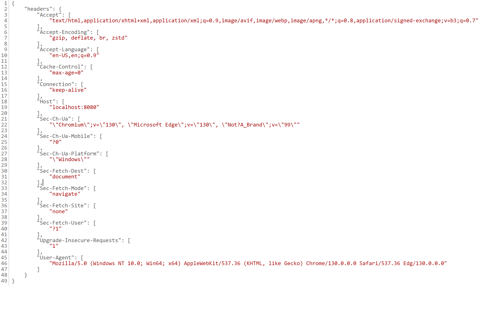
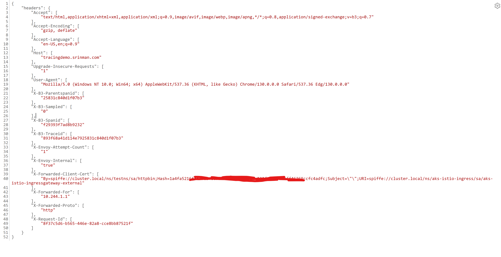

# Istio Observability Lab

## Overview

This lab demonstrates how to implement comprehensive observability for Istio service mesh using Azure Monitor, Grafana, and distributed tracing. You'll learn to monitor metrics, analyze logs, and trace requests across your microservices architecture.

## Learning Objectives

By the end of this lab, you will understand and implement:

1. **Azure Monitor Integration**: Setting up metrics collection infrastructure
2. **Prometheus Metrics Collection**: Understanding and viewing Istio service mesh metrics  
3. **Centralized Logging**: Envoy access logs and centralized log analysis with Azure Log Analytics
4. **Service Mesh Visualization**: Service topology and traffic flow analysis with Kiali
5. **Distributed Tracing**: Request tracing across services using Jaeger


## Environment Preparation and Cleanup

### Step 1: Verify Prerequisites

**Check your AKS cluster and Istio installation:**

```bash
# Verify AKS cluster is running
kubectl get nodes

# Verify Istio control plane is installed
kubectl get pods -n aks-istio-system

# Check Istio revision
kubectl get namespace -l istio.io/rev --show-labels

# Verify Istio ingress gateway
kubectl get svc -n aks-istio-ingress
```

### Step 2: Clean Up Existing Test Deployments

**Remove any existing test applications and namespaces:**

```bash
# Clean up common test namespaces that might exist
kubectl delete namespace bookinfo testns testns2 --ignore-not-found=true

# Clean up any existing observability tools
kubectl delete -f https://raw.githubusercontent.com/istio/istio/release-1.23/samples/addons/jaeger.yaml --ignore-not-found=true
kubectl delete -f https://raw.githubusercontent.com/istio/istio/release-1.23/samples/addons/kiali.yaml --ignore-not-found=true

# Wait for namespaces to be fully deleted
echo "Waiting for namespaces to be deleted..."
while kubectl get namespace bookinfo testns testns2 2>/dev/null | grep -q Terminating; do
  echo "Still deleting namespaces..."
  sleep 10
done
echo "Cleanup complete!"
```

### Step 3: Verify Clean Environment

**Confirm the environment is ready:**

```bash
# Verify test namespaces are gone
kubectl get namespace | grep -E "(bookinfo|testns)"
# Expected: No output

# Check for any running port-forwards and kill them
pkill -f "kubectl port-forward" || echo "No existing port-forwards found"

# Verify Azure Monitor metrics addon status
az aks show --name aksistio4 --resource-group aksistio4rg --query "azureMonitorProfile.metrics.enabled" -o tsv

# Check if ama-metrics is running
kubectl get pods -n kube-system | grep ama-metrics
```

### Step 4: Set Environment Variables

**Set up commonly used variables for the lab:**

```bash
# Set cluster information
export CLUSTER_NAME="aksistio4"
export RESOURCE_GROUP="aksistio4rg"
export INFRA_RG="infrarg"
export AMW_NAME="amwforaks"
export AMG_NAME="amgforaks"
export CLUSTER=aksistio4
export RESOURCE_GROUP=aksistio4rg
export LOCATION=eastus2

# Verify Azure resources exist
echo "Verifying Azure resources..."
az aks show --name $CLUSTER_NAME --resource-group $RESOURCE_GROUP --query "name" -o tsv
az monitor account show --resource-group $INFRA_RG --name $AMW_NAME --query "name" -o tsv
az grafana show --resource-group $INFRA_RG --name $AMG_NAME --query "name" -o tsv

echo "✅ Environment preparation complete!"
```

**Expected Output:**
```
✅ Environment preparation complete!
aksistio4
amwforaks
amgforaks
```

---

## Lab Exercise 1: Setting Up Azure Monitor Integration

### Prerequisites

Ensure you have the following Azure resources:
- Azure Monitor Workspace (AMW)
- Azure Managed Grafana (AMG)
- AKS cluster with Istio service mesh

### Step 1: Enable Prometheus and Grafana Integration

**Get the resource IDs for your monitoring infrastructure:**

```bash
export amwrid=$(az monitor account show --resource-group infrarg --name amwforaks --query id -o tsv)
export amgrid=$(az grafana show --resource-group infrarg --name amgforaks --query id -o tsv)

# Verify the resource IDs
echo "Azure Monitor Workspace ID: $amwrid"
echo "Azure Managed Grafana ID: $amgrid"
```

**Enable Azure Monitor metrics on your AKS cluster:**

```bash
az aks update \
  --enable-azure-monitor-metrics \
  --name aksistio4 \
  --resource-group aksistio4rg \
  --azure-monitor-workspace-resource-id $amwrid \
  --grafana-resource-id $amgrid
```

**Expected Result**: Azure Monitor metrics collection is enabled, and your cluster will start sending Prometheus-compatible metrics to Azure Monitor Workspace.

### Step 2: Configure Grafana Dashboards

**Access Azure Managed Grafana:**

1. Navigate to your Azure Managed Grafana instance in the Azure portal
2. Click **Endpoint** to open Grafana

**Import Kubernetes Dashboard:**

1. Click **Dashboard** in the left sidebar
2. Click **New** → **Import** in the top right
3. Enter dashboard ID: `7645`
4. Click **Load**
5. Select your Azure Monitor Workspace as the Prometheus data source
6. Click **Import**

**Import Istio-specific dashboards:**

For comprehensive Istio monitoring, import these additional dashboards:

- **Istio Service Dashboard**: ID `7636`
- **Istio Workload Dashboard**: ID `7630` 
- **Istio Performance Dashboard**: ID `11829`

---

## Lab Exercise 2: Prometheus Metrics Collection

### Understanding Istio Metrics

Istio automatically generates metrics for:
- **Request rates, latencies, and error rates**
- **Service-to-service communication**
- **Workload performance**
- **Control plane health**

### Step 1: Deploy Sample Application for Metrics

**Deploy the Bookinfo application for comprehensive metrics testing:**

```bash
# check revision and use it for labelling namespace below
az aks show --name ${CLUSTER} --resource-group ${RESOURCE_GROUP} --query 'serviceMeshProfile'
# Create and label namespace
kubectl create namespace bookinfo
kubectl label namespace bookinfo istio.io/rev=asm-1-25

# Deploy bookinfo application
kubectl apply -f https://raw.githubusercontent.com/istio/istio/release-1.18/samples/bookinfo/platform/kube/bookinfo.yaml -n bookinfo

# Wait for pods to be ready
kubectl wait --for=condition=Ready pod -l app=productpage -n bookinfo --timeout=120s

# Verify sidecars are injected (should show 2/2 containers)
kubectl get pods -n bookinfo
```

**Create Gateway and VirtualService for external access:**

```bash
kubectl apply -f - <<EOF
apiVersion: networking.istio.io/v1alpha3
kind: Gateway
metadata:
  name: bookinfo-gateway
  namespace: bookinfo
spec:
  selector:
    istio: aks-istio-ingressgateway-external
  servers:
  - port:
      number: 80
      name: http
      protocol: HTTP
    hosts:
    - "*"
---
apiVersion: networking.istio.io/v1alpha3
kind: VirtualService
metadata:
  name: bookinfo
  namespace: bookinfo
spec:
  hosts:
  - "*"
  gateways:
  - bookinfo-gateway
  http:
  - match:
    - uri:
        exact: /productpage
    - uri:
        prefix: /static
    - uri:
        exact: /login
    - uri:
        exact: /logout
    - uri:
        prefix: /api/v1/products
    route:
    - destination:
        host: productpage
        port:
          number: 9080
EOF
```

```bash
# ensure that only bookinfo-gateway is listed - delete other gateway resources if any 
kubectl get gateway -A 

istioctl -n aks-istio-ingress proxy-config listener deploy/aks-istio-ingressgateway-external-asm-1-25
# Expected output below!
#ADDRESSES PORT  MATCH DESTINATION
#0.0.0.0   80    ALL   Route: http.80
#0.0.0.0   15021 ALL   Inline Route: /healthz/ready*
#0.0.0.0   15090 ALL   Inline Route: /stats/prometheus*


istioctl -n aks-istio-ingress proxy-config route deploy/aks-istio-ingressgateway-external-asm-1-25
# Expected output below!
#NAME        VHOST NAME     DOMAINS     MATCH                  VIRTUAL SERVICE
#http.80     *:80           *           /productpage           bookinfo.bookinfo
#http.80     *:80           *           /static*               bookinfo.bookinfo
#http.80     *:80           *           /login                 bookinfo.bookinfo
#http.80     *:80           *           /logout                bookinfo.bookinfo
#http.80     *:80           *           /api/v1/products*      bookinfo.bookinfo
#            backend        *           /stats/prometheus*     
#            backend        *           /healthz/ready* 


# Try to access the external IP (should get 404 - no routes configured yet)
EXTERNAL_IP=$(kubectl get svc aks-istio-ingressgateway-external -n aks-istio-ingress -o jsonpath='{.status.loadBalancer.ingress[0].ip}')
echo "External IP: $EXTERNAL_IP"

curl -v http://$EXTERNAL_IP/productpage
# expected result:  curl is able to get page content

```

### Step 1.5: Configure Azure Monitor Managed Prometheus for Istio Metrics

Reference documentation:  
https://learn.microsoft.com/en-us/azure/azure-monitor/containers/kubernetes-monitoring-enable?tabs=cli  

Terminology: 
Workspace - place to store metrics or logs
Azure Managed Workspace -  It's a managed Prometheus and a place to store prometheus metrics
Log Analytics Workspace -  It's a managed logging solution and a place to store container logs and also control plane logs  
Azure Managed Grafana Workspace - It's a managed Grafana to make the Prometheus metrics collected from your cluster available via Grafana dashboards

Before verifying Istio proxy metrics, we need to configure Azure Monitor Managed Prometheus to properly scrape Istio metrics. This requires creating specific configmaps in the `kube-system` namespace.

#### Azure Monitor Managed Prometheus ConfigMaps Overview

Azure Monitor Managed Prometheus supports four different configmaps that provide scrape configuration and settings for the metrics add-on. All configmaps must be applied to the `kube-system` namespace.

> ⚠️ **Important**: None of these configmaps exist by default when Managed Prometheus is enabled. You must deploy the configmaps you need, and AMA-Metrics pods will restart in 2-3 minutes to apply the new configuration.

| ConfigMap Name | Purpose | Scope | AMA Pod Reading It | Use Case |
|---|---|---|---|---|
| **ama-metrics-settings-configmap**   https://aka.ms/azureprometheus-addon-settings-configmap  | General addon settings and configuration | Cluster-wide | **All AMA pods**<br>- `ama-metrics-*` (replica)<br>- `ama-metrics-node-*` (DaemonSet)<br>- `ama-metrics-ksm-*` (kube-state-metrics)<br>- `ama-metrics-operator-targets-*` | - Enable/disable default scrape targets<br>- Configure pod annotation-based scraping<br>- Set metric keep-lists and scrape intervals<br>- Control cluster alias and debug mode |
| **ama-metrics-prometheus-config** | Custom Prometheus scrape jobs for cluster-level services | Replica (singleton) | **`ama-metrics-*` (replica pod only)**<br>- Handles cluster-wide targets<br>- Runs as single instance | - Add custom scrape jobs for any services<br>- **✅ Sufficient for Istio metrics collection**<br>- Configure service discovery and relabeling<br>- Scrape both mesh and proxy metrics |
| **ama-metrics-prometheus-config-node** | Custom Prometheus scrape jobs for node-level targets | DaemonSet (per Linux node) | **`ama-metrics-node-*` (DaemonSet pods only)**<br>- One pod per Linux node<br>- Access to `$NODE_IP` variable | - Scrape node-specific services<br>- Access services using `$NODE_IP` variable<br>- Collect per-node metrics |
| **ama-metrics-prometheus-config-node-windows** | Custom Prometheus scrape jobs for Windows node-level targets | DaemonSet (per Windows node) | **`ama-metrics-node-windows-*` (Windows DaemonSet pods only)**<br>- One pod per Windows node<br>- Access to `$NODE_IP` variable | - Scrape Windows node-specific services<br>- Access services using `$NODE_IP` variable<br>- Collect per-Windows-node metrics |

**For Istio observability:**
- **Primary**: `ama-metrics-prometheus-config` - **This single configmap is sufficient** to collect all Istio metrics including `istio_requests_total`, mesh metrics, and proxy metrics
- **Optional**: `ama-metrics-settings-configmap` - Only needed if you want to customize default scrape settings or enable additional features like pod annotation-based scraping

> 💡 **Key Insight**: Based on testing, the `ama-metrics-prometheus-config` configmap with proper Kubernetes service discovery can successfully scrape Istio metrics from istio-proxy containers without requiring pod annotation-based scraping configuration.

**Step 1.5.1: Enable Pod Annotation-Based Scraping**

Azure Monitor Managed Prometheus can automatically discover and scrape metrics from pods with specific annotations. Create the settings configmap to enable this feature:

```bash
# Create the ama-metrics-settings-configmap to enable pod annotation scraping for istio-system namespace
kubectl apply -f - <<EOF
apiVersion: v1
kind: ConfigMap
metadata:
  name: ama-metrics-settings-configmap
  namespace: kube-system
data:
  schema-version: v1
  config-version: 1.0.0
  pod-annotation-based-scraping: |-
    podannotationnamespaceregex = "istio-system|aks-istio-ingress|bookinfo"
  default-scrape-settings-enabled: |-
    kubelet = true
    coredns = false
    cadvisor = true
    kubeproxy = false
    apiserver = false
    kubestate = true
    nodeexporter = true
    windowsexporter = false
    windowskubeproxy = false
    kappiebasic = true
    prometheuscollectorhealth = false
  default-targets-metrics-keep-list: |-
    kubelet = ""
    coredns = ""
    cadvisor = ""
    kubeproxy = ""
    apiserver = ""
    kubestate = ""
    nodeexporter = ""
    windowsexporter = ""
    windowskubeproxy = ""
    kappiebasic = ""
    prometheuscollectorhealth = ""
    minimalingestionprofile = true
  default-targets-scrape-interval-settings: |-
    kubelet = "30s"
    coredns = "30s"
    cadvisor = "30s"
    kubeproxy = "30s"
    apiserver = "30s"
    kubestate = "30s"
    nodeexporter = "30s"
    windowsexporter = "30s"
    windowskubeproxy = "30s"
    kappiebasic = "30s"
    prometheuscollectorhealth = "30s"
    podannotations = "30s"
EOF
```

**Step 1.5.2: Create Custom Prometheus Scrape Configuration**

Create a custom scrape configuration to collect Istio-specific metrics:

```bash
# Create prometheus scrape config for Istio metrics
kubectl apply -f - <<EOF
apiVersion: v1
kind: ConfigMap
metadata:
  name: ama-metrics-prometheus-config
  namespace: kube-system
data:
  prometheus-config: |
    global:
      scrape_interval: 30s
    scrape_configs:
    - job_name: 'istio-mesh'
      kubernetes_sd_configs:
      - role: endpoints
        namespaces:
          names:
          - istio-system
          - aks-istio-ingress
          - bookinfo
      relabel_configs:
      - source_labels: [__meta_kubernetes_service_name, __meta_kubernetes_endpoint_port_name]
        action: keep
        regex: istio-proxy;http-monitoring
      - source_labels: [__meta_kubernetes_service_annotation_prometheus_io_scrape]
        action: keep
        regex: true
      - source_labels: [__meta_kubernetes_service_annotation_prometheus_io_path]
        action: replace
        target_label: __metrics_path__
        regex: (.+)
      - source_labels: [__address__, __meta_kubernetes_service_annotation_prometheus_io_port]
        action: replace
        regex: ([^:]+)(?::\d+)?;(\d+)
        replacement: \$1:\$2
        target_label: __address__
      - action: labelmap
        regex: __meta_kubernetes_service_label_(.+)
      - source_labels: [__meta_kubernetes_namespace]
        action: replace
        target_label: kubernetes_namespace
      - source_labels: [__meta_kubernetes_service_name]
        action: replace
        target_label: kubernetes_name
    
    - job_name: 'istio-proxy'
      kubernetes_sd_configs:
      - role: pod
        namespaces:
          names:
          - istio-system
          - aks-istio-ingress
          - bookinfo
      relabel_configs:
      - source_labels: [__meta_kubernetes_pod_container_name]
        action: keep
        regex: istio-proxy
      - source_labels: [__meta_kubernetes_pod_annotation_prometheus_io_scrape]
        action: keep
        regex: true
      - source_labels: [__meta_kubernetes_pod_annotation_prometheus_io_path]
        action: replace
        target_label: __metrics_path__
        regex: (.+)
      - source_labels: [__address__, __meta_kubernetes_pod_annotation_prometheus_io_port]
        action: replace
        regex: ([^:]+)(?::\d+)?;(\d+)
        replacement: \$1:\$2
        target_label: __address__
      - action: labelmap
        regex: __meta_kubernetes_pod_label_(.+)
      - source_labels: [__meta_kubernetes_namespace]
        action: replace
        target_label: kubernetes_namespace
      - source_labels: [__meta_kubernetes_pod_name]
        action: replace
        target_label: kubernetes_pod_name
      metric_relabel_configs:
      - source_labels: [__name__]
        regex: 'istio_.*'
        action: keep
EOF
```

**Step 1.5.3: Verify AMA-Metrics Pods Restart**

After creating the configmaps, the AMA-Metrics pods will automatically restart to pick up the new configuration:

```bash
# Watch for AMA-Metrics pods to restart (this may take 2-3 minutes)
echo "Waiting for AMA-Metrics pods to restart with new configuration..."
#kubectl get pods -n kube-system -l app.kubernetes.io/name=ama-metrics -w

# Verify the configmaps are created
kubectl get configmap -n kube-system | grep ama-metrics

# Check AMA-Metrics logs for configuration loading
#kubectl logs -n kube-system -l app.kubernetes.io/name=ama-metrics -c prometheus-collector 
```

**Step 1.5.4: Verify Prometheus Annotations on Istio Pods**

Ensure that Istio pods have the correct Prometheus annotations for scraping:

```bash
# Check bookinfo pods for prometheus annotations
kubectl get pods -n bookinfo -o yaml | grep -A 5 -B 5 "prometheus.io"

# Verify istio-proxy containers have the scrape annotations
kubectl describe pods -n bookinfo | grep -A 10 -B 10 "prometheus.io"
```

The key annotations that should be present are:
- `prometheus.io/scrape: "true"`
- `prometheus.io/path: "/stats/prometheus"`
- `prometheus.io/port: "15020"`

**Step 1.5.5: Important Configuration Notes**

⚠️ **Important**: None of the four configmaps (`ama-metrics-settings-configmap`, `ama-metrics-prometheus-config`, `ama-metrics-prometheus-config-node`, `ama-metrics-prometheus-config-node-windows`) exist by default when Managed Prometheus is enabled. 

The AMA-Metrics pods will automatically:
1. Detect the new configmaps in the `kube-system` namespace
2. Restart in 2-3 minutes to apply the new configuration
3. Begin scraping metrics according to the new settings

## Istio Metrics Architecture Overview

Before diving into the verification steps, let's understand how Istio metrics flow from generation to visualization:

```
┌─────────────────────────────────────────────────────────────────────────────────┐
│                           AKS Cluster with Istio Service Mesh                  │
│                                                                                 │
│  ┌─────────────────────┐    ┌─────────────────────┐    ┌─────────────────────┐  │
│  │   Pod: netshoot     │    │   Pod: client       │    │   Pod: productpage  │  │
│  │  ┌───────────────┐  │    │  ┌───────────────┐  │    │  ┌───────────────┐  │  │
│  │  │ netshoot      │  │    │  │ netshoot      │  │    │  │ productpage   │  │  │
│  │  │ container     │  │    │  │ container     │  │    │  │ container     │  │  │
│  │  └───────────────┘  │    │  └───────────────┘  │    │  └───────────────┘  │  │
│  │  ┌───────────────┐  │    │  ┌───────────────┐  │    │  ┌───────────────┐  │  │
│  │  │ istio-proxy   │◄─┼────┼──┤ istio-proxy   │    │    │  │ istio-proxy   │  │  │
│  │  │ (Envoy)       │  │    │  │ (Envoy)       │    │    │  │ (Envoy)       │  │  │
│  │  │ :15000/stats/ │  │    │  │ :15000/stats/ │    │    │  │ :15000/stats/ │  │  │
│  │  │ prometheus    │  │    │  │ prometheus    │    │    │  │ prometheus    │  │  │
│  │  └───────────────┘  │    │  └───────────────┘  │    │  └───────────────┘  │  │
│  └─────────────────────┘    └─────────────────────┘    └─────────────────────┘  │
│           ▲                           │                           ▲             │
│           │ [Step 2]                  │ HTTP Request              │             │
│           │ Verify metrics            │ TO netshoot               │             │
│           │ generation                │ service                   │             │
│           │                           ▼                           │             │
│  ┌─────────────────────┐    ┌─────────────────────┐              │             │
│  │ AMA-Metrics Pods    │    │   Kubernetes        │              │             │
│  │ (Azure Monitor      │    │   Service           │              │             │
│  │ Managed Prometheus) │    │   Discovery         │              │             │
│  │                     │    │                     │              │             │
│  │ ┌─────────────────┐ │    │ ┌─────────────────┐ │              │             │
│  │ │ ama-metrics-*   │ │    │ │ netshoot-svc    │ │              │             │
│  │ │ (replica)       │ │    │ │ :8080           │ │              │             │
│  │ │                 │ │    │ └─────────────────┘ │              │             │
│  │ │ Scrapes :15000/ │ │    └─────────────────────┘              │             │
│  │ │ stats/prometheus│ │                                         │             │
│  │ └─────────────────┘ │                                         │             │
│  └─────────────────────┘                                         │             │
│           │ [Step 3]                                              │             │
│           │ Verify scraping                                       │             │
│           │                                                       │             │
│           ▼                                                       │             │
└─────────────────────────────────────────────────────────────────────────────────┘
            │                                                       │
            │ [Step 4]                                              │
            │ Verify metrics in AMW                                 │
            │                                                       │
            ▼                                                       │
┌─────────────────────────────────────────────────────────────────────────────────┐
│                     Azure Monitor Workspace (AMW)                              │
│                                                                                 │
│  ┌─────────────────────────────────────────────────────────────────────────┐    │
│  │                 Managed Prometheus Storage                              │    │
│  │                                                                         │    │
│  │  ┌─────────────────┐ ┌─────────────────┐ ┌─────────────────┐          │    │
│  │  │ istio_requests_ │ │ istio_request_  │ │ up              │          │    │
│  │  │ total           │ │ duration_ms     │ │                 │          │    │
│  │  │ {labels...} 31  │ │ {labels...}     │ │ {labels...} 1   │          │    │
│  │  └─────────────────┘ └─────────────────┘ └─────────────────┘          │    │
│  └─────────────────────────────────────────────────────────────────────────┘    │
└─────────────────────────────────────────────────────────────────────────────────┘
            │ [Step 5]
            │ Verify metrics in AMG
            │
            ▼
┌─────────────────────────────────────────────────────────────────────────────────┐
│                     Azure Managed Grafana (AMG)                                │
│                                                                                 │
│  ┌─────────────────────────────────────────────────────────────────────────┐    │
│  │                        Grafana Dashboards                               │    │
│  │                                                                         │    │
│  │  ┌─────────────────┐ ┌─────────────────┐ ┌─────────────────┐          │    │
│  │  │ Istio Service   │ │ Istio Workload  │ │ Request Rate    │          │    │
│  │  │ Dashboard       │ │ Dashboard       │ │ Graph           │          │    │
│  │  │ (ID: 7636)      │ │ (ID: 7630)      │ │                 │          │    │
│  │  └─────────────────┘ └─────────────────┘ └─────────────────┘          │    │
│  └─────────────────────────────────────────────────────────────────────────┘    │
└─────────────────────────────────────────────────────────────────────────────────┘
```

## Metrics Flow Explanation:

**🔄 Step 2: Metrics Generation**
- Istio sidecars (Envoy proxies) automatically generate metrics for incoming/outgoing requests
- Metrics are exposed at `:15000/stats/prometheus` endpoint on each pod
- We verify this by sending traffic TO netshoot and checking its metrics

**📊 Step 3: Metrics Collection**  
- Azure Monitor Managed Prometheus (AMA-Metrics pods) scrape Envoy endpoints
- Uses Kubernetes service discovery to find Istio-enabled pods
- Configured via `ama-metrics-prometheus-config` ConfigMap

**🗄️ Step 4: Metrics Storage**
- Scraped metrics are stored in Azure Monitor Workspace (AMW)
- AMW provides Prometheus-compatible storage and query API
- Accessible via REST API with Azure authentication

**📈 Step 5: Metrics Visualization**
- Azure Managed Grafana (AMG) queries AMW as data source
- Pre-built Istio dashboards show service topology, request rates, latencies
- Provides interactive visualization and alerting capabilities

### Step 2: Verify Istio Proxy Metrics Generation

**Understanding Istio Metrics:**

The `istio_requests_total` metric counts incoming requests TO a pod with Istio sidecar. To generate these metrics, we need to send traffic TO the netshoot pod (not from it).

**Step 2.1: Create Netshoot Pod with Istio Sidecar**

```bash
# ensure default ns is labelled with istio.io/rev=asm-1-25
k get ns default --show-labels
# Create netshoot pod in default namespace (which should have Istio injection enabled)
kubectl run netshoot --image=nicolaka/netshoot -- sh -c 'sleep 3600'

# Wait for pod to be ready (should show 2/2 containers - app + istio-proxy)
kubectl wait --for=condition=Ready pod/netshoot --timeout=60s

# Verify Istio sidecar is injected
kubectl get pod netshoot
# Expected result: Should show READY 2/2 (app container + istio-proxy sidecar)
```

**Step 2.2: Initial Metrics Check (Should Show Zero)**

```bash
# Check current metrics - should be 0 initially since no traffic has been sent TO the pod
kubectl exec netshoot -- curl -s localhost:15000/stats/prometheus | grep istio_requests_total | wc -l
# Expected result: 0 (no incoming requests yet)
```

**Step 2.3: Set Up HTTP Server and Service**

```bash
# Create a service to expose the netshoot pod
kubectl expose pod netshoot --port=8080 --target-port=8080 --name=netshoot-service

# Start a simple HTTP server inside the netshoot pod
kubectl exec netshoot -- sh -c 'nohup python3 -m http.server 8080 > /dev/null 2>&1 &'

# Verify the HTTP server is running
kubectl exec netshoot -- netstat -tlnp | grep 8080
# Expected result: Should show python3 listening on port 8080
```

**Step 2.4: Create Client Pod**

```bash
# Create a client pod to send requests TO the netshoot service
kubectl run client --image=nicolaka/netshoot -- sh -c 'sleep 3600'

# Wait for client pod to be ready
kubectl wait --for=condition=Ready pod/client --timeout=60s
```

**Step 2.5: Generate Traffic and Verify Metrics**

```bash
# Send a test request to verify connectivity
kubectl exec client -- curl -s http://netshoot-service:8080/ | head -5
# Expected result: Should show HTML directory listing

# Generate multiple requests to increase the metrics counter
kubectl exec client -- sh -c 'for i in $(seq 1 10); do curl -s http://netshoot-service:8080/ > /dev/null; echo "Request $i sent"; done'
```

**Step 2.6: Verify Istio Metrics Are Generated**

```bash
# Check that istio_requests_total metrics now exist
kubectl exec netshoot -- curl -s localhost:15000/stats/prometheus | grep istio_requests_total | wc -l
# Expected result: Should show 2 (instead of 0) - indicating metrics are being generated

# View the actual metrics with request counts
kubectl exec netshoot -- curl -s localhost:15000/stats/prometheus | grep istio_requests_total
# Expected result: Should show metrics with counter values like "istio_requests_total{...} 11"
```

**Step 2.7: Continue Generating Traffic (Optional)**

```bash
# Send more requests to see the counter increase
kubectl exec client -- sh -c 'for i in $(seq 1 20); do curl -s http://netshoot-service:8080/ > /dev/null; echo -n "."; done; echo " Done!"'

# Check updated counter - should show increased values
kubectl exec netshoot -- curl -s localhost:15000/stats/prometheus | grep istio_requests_total | grep -o 'istio_requests_total{.*} [0-9]*$'
# Expected result: Counter should show 31 (11 from previous step + 20 new requests)
```

**Expected Result**: The `istio_requests_total` counter should now show increasing values as traffic is sent to the netshoot service. Each request increments the counter, demonstrating that Istio is properly collecting metrics for incoming requests.

### Step 3: Verify Azure Monitor Metrics Scraping

**Step 3.1: Check Azure Monitor Addon Status**

```bash
# Verify Azure Monitor metrics addon is enabled
az aks show --name aksistio4 --resource-group aksistio4rg --query "azureMonitorProfile.metrics.enabled" -o tsv
# Expected result: true

# Check if ama-metrics pods are running
kubectl get pods -n kube-system | grep ama-metrics
# Expected result: ama-metrics pods in Running state

# Verify Azure Monitor configuration
kubectl get configmap -n kube-system | grep ama
```


### Step 4: Verify Metrics in Azure Monitor Workspace

**Step 4.1: Access Azure Monitor Workspace**

```bash
# Get your Azure Monitor Workspace details
export amwrid=$(az monitor account show --resource-group infrarg --name amwforaks --query id -o tsv)
echo "Azure Monitor Workspace ID: $amwrid"

# Get the query endpoint URL
az monitor account show --resource-group infrarg --name amwforaks --query "metrics.prometheusQueryEndpoint" -o tsv
```

**Step 4.2: Test Prometheus Query API**

```bash
# Get access token for Azure Monitor
export ACCESS_TOKEN=$(az account get-access-token --resource https://prometheus.monitor.azure.com --query accessToken -o tsv)

# Test basic connectivity to Prometheus endpoint
export AMW_ENDPOINT=$(az monitor account show --resource-group infrarg --name amwforaks --query "metrics.prometheusQueryEndpoint" -o tsv)
echo "Prometheus endpoint: $AMW_ENDPOINT"

# Test query for basic metrics
curl -H "Authorization: Bearer $ACCESS_TOKEN" \
  -G "$AMW_ENDPOINT/api/v1/query" \
  --data-urlencode 'query=up' | jq .

# Test query for Istio metrics
curl -H "Authorization: Bearer $ACCESS_TOKEN" \
  -G "$AMW_ENDPOINT/api/v1/query" \
  --data-urlencode 'query=istio_requests_total' | jq .
```

**Step 4.3: Verify Metrics in Azure Portal**

```bash
# Navigate to Azure Portal → Monitor → Workspaces → [Your AMW] → Metrics Explorer
# Run these queries in the Azure Portal Metrics Explorer:

# Query 1: Check if any metrics exist
# up

# Query 2: Check for Istio request metrics
# istio_requests_total

# Query 3: Check metrics with specific labels
# istio_requests_total{destination_service_name="productpage"}
```

**Expected Results for Azure Monitor Workspace:**
- `up` query should return targets with value 1 (indicating successful scraping)
- `istio_requests_total` should return metrics with various labels
- Metrics should have recent timestamps (within last few minutes)

### Step 5: Verify Metrics in Grafana

**Step 5.1: Test Grafana Data Source Connection**

```bash
# Get Grafana details
export amgrid=$(az grafana show --resource-group infrarg --name amgforaks --query id -o tsv)
echo "Azure Managed Grafana ID: $amgrid"

# Get Grafana endpoint
az grafana show --resource-group infrarg --name amgforaks --query "properties.endpoint" -o tsv
```

**Manual Steps in Grafana UI:**

1. **Access Grafana**: Navigate to your Azure Managed Grafana endpoint
2. **Check Data Source**: 
   - Go to Configuration → Data Sources
   - Find "Azure Monitor Workspace" data source
   - Click "Test" to verify connection
   - Expected result: "Data source is working"

**Step 5.2: Test Basic Queries in Grafana Explore**

1. **Open Grafana Explore**: Click the compass icon
2. **Select Azure Monitor Workspace** as data source
3. **Test basic connectivity**:
   ```promql
   up
   ```
   Expected result: Should show metrics with value 1

4. **Test Istio metrics**:
   ```promql
   istio_requests_total
   ```
   Expected result: Should show request metrics with labels

5. **Test specific service metrics**:
   ```promql
   istio_requests_total{destination_service_name="productpage"}
   ```

**Step 5.3: Verify Dashboard Data**

1. **Import Istio Dashboard**: Use ID `7636` for Istio Service Dashboard
2. **Configure Dashboard**:
   - Set data source to Azure Monitor Workspace
   - Set time range to "Last 15 minutes"
   - Select service "productpage" from dropdown

3. **Generate More Traffic** (if no data appears):
   ```bash
   # Generate continuous traffic
   for i in {1..50}; do
     curl -s "http://$INGRESS_IP/productpage" > /dev/null
     echo "Request $i completed"
     sleep 2
   done
   ```

**Step 5.4: Troubleshoot Grafana Issues**

```bash
# If dashboard shows "No data":

# 1. Check time range - set to last 15-30 minutes
# 2. Verify service selection - choose "productpage"
# 3. Generate more traffic:
curl --parallel --parallel-immediate --parallel-max 5 $(printf "http://$INGRESS_IP/productpage %.0s" {1..25})

# 4. Test individual queries in Explore:
# - istio_requests_total
# - rate(istio_requests_total[5m])
# - sum(rate(istio_requests_total[5m])) by (destination_service_name)
```

### Step 6: Complete Pipeline Validation

**Validate the entire metrics pipeline with this checklist:**

```bash
# 1. Istio Proxy Metrics Generation ✓
echo "Step 1: Checking Istio proxy metrics..."
kubectl exec netshoot -- curl -s localhost:15000/stats/prometheus | grep istio_requests_total | wc -l

# 2. Azure Monitor Scraping ✓ 
echo "Step 2: Checking Azure Monitor scraping..."
kubectl logs deployment/ama-metrics -n kube-system --tail=10 | grep -i error || echo "No recent errors found"

# 3. Azure Monitor Workspace Availability ✓
echo "Step 3: Testing Azure Monitor Workspace..."
curl -H "Authorization: Bearer $(az account get-access-token --resource https://prometheus.monitor.azure.com --query accessToken -o tsv)" \
  -G "$(az monitor account show --resource-group infrarg --name amwforaks --query "metrics.prometheusQueryEndpoint" -o tsv)/api/v1/query" \
  --data-urlencode 'query=up' | jq '.data.result | length'

# 4. Grafana Connectivity ✓
echo "Step 4: Grafana - manual verification required in UI"
echo "  - Check data source connection"
echo "  - Test query: istio_requests_total"
echo "  - Verify dashboard shows data"

echo "Pipeline validation complete!"
```

### Step 7: Key Metrics to Monitor

**Essential Grafana queries for Istio metrics:**

```promql
# Request rate by service
sum(rate(istio_requests_total[5m])) by (destination_service_name)

# Success rate
sum(rate(istio_requests_total{response_code!~"5.*"}[5m])) / sum(rate(istio_requests_total[5m]))

# P99 latency
histogram_quantile(0.99, sum(rate(istio_request_duration_milliseconds_bucket[5m])) by (le))

# Error rate by service
sum(rate(istio_requests_total{response_code=~"5.*"}[5m])) by (destination_service_name) / sum(rate(istio_requests_total[5m])) by (destination_service_name)

# Incoming requests to productpage
sum(rate(istio_requests_total{destination_service_name="productpage"}[5m]))
```

### Step 8: Enable Container Insights (Optional)

**For additional container and node-level monitoring:**

```bash
export lawrid=$(az monitor log-analytics workspace show --resource-group infrarg --name akscontainerinsightslogs --query id -o tsv)

az aks enable-addons \
  --addon monitoring \
  --name aksistio4 \
  --resource-group aksistio4rg \
  --workspace-resource-id $lawrid
```

**Note**: This enables container logs collection for the AKS data plane (not control plane logs). This complements the Istio metrics you've just configured by providing additional container and node-level insights.

---

## Lab Exercise 3: Implementing Centralized Logging

Istio uses Envoy proxies to generate detailed access logs. The Telemetry API allows you to configure logging at different scopes:

- **Mesh-wide**: Apply logging to all services
- **Namespace-level**: Apply logging to specific namespaces  
- **Service-level**: Apply logging to individual services

In this lab, we'll demonstrate **namespace-level logging** by creating two test environments: one with logging enabled and one without, allowing you to compare the difference.

### Step 1: Create Test Environment

**Create the first test namespace:**

```bash
kubectl create namespace testns
kubectl label namespace testns istio.io/rev=asm-1-25

# Create a test pod for making requests
kubectl -n testns run netshoot --image=nicolaka/netshoot -- sh -c 'sleep 2000'

# Create a service account
kubectl create serviceaccount httpbin -n testns
```

**Deploy httpbin service in testns:**

```bash
kubectl apply -f - <<EOF
apiVersion: v1
kind: Service
metadata:
  name: httpbin
  namespace: testns
  labels:
    app: httpbin
    service: httpbin
spec:
  ports:
  - name: http
    port: 8000
    targetPort: 8080
  selector:
    app: httpbin
---
apiVersion: apps/v1
kind: Deployment
metadata:
  name: httpbin
  namespace: testns
spec:
  replicas: 1
  selector:
    matchLabels:
      app: httpbin
      version: v1
  template:
    metadata:
      labels:
        app: httpbin
        version: v1
    spec:
      serviceAccountName: httpbin
      containers:
      - image: docker.io/mccutchen/go-httpbin:v2.15.0
        imagePullPolicy: IfNotPresent
        name: httpbin
        ports:
        - containerPort: 8080
EOF
```

### Step 2: Configure Namespace-Specific Logging

**Enable detailed logging for the testns namespace only:**

```bash
kubectl apply -f - <<EOF
apiVersion: telemetry.istio.io/v1
kind: Telemetry
metadata:
  name: ns-logging-testns
  namespace: testns
spec:
  accessLogging:
  - providers:
    - name: envoy
EOF
```

### Step 3: Test Logging Configuration

**Generate traffic and observe logs:**

```bash
# Wait for pods to be ready
kubectl wait --for=condition=Ready pod -l app=httpbin -n testns --timeout=60s

# Make a test request
kubectl -n testns exec -it netshoot -- curl http://httpbin:8000/get

# Check envoy proxy logs
kubectl logs -l app=httpbin -n testns -c istio-proxy --tail=5
```

**Expected Result**: You should see detailed access logs including request details, response codes, and timing information.

### Step 4: Create Comparison Environment (No Logging)

**Create a second namespace without any logging configuration:**

```bash
kubectl create namespace testns2
kubectl label namespace testns2 istio.io/rev=asm-1-25

kubectl -n testns2 run netshoot --image=nicolaka/netshoot -- sh -c 'sleep 2000'
kubectl create serviceaccount httpbin -n testns2
```

**Deploy httpbin service in testns2:**

```bash
kubectl apply -f - <<EOF
apiVersion: v1
kind: Service
metadata:
  name: httpbin
  namespace: testns2
  labels:
    app: httpbin
    service: httpbin
spec:
  ports:
  - name: http
    port: 8000
    targetPort: 8080
  selector:
    app: httpbin
---
apiVersion: apps/v1
kind: Deployment
metadata:
  name: httpbin
  namespace: testns2
spec:
  replicas: 1
  selector:
    matchLabels:
      app: httpbin
      version: v1
  template:
    metadata:
      labels:
        app: httpbin
        version: v1
    spec:
      serviceAccountName: httpbin
      containers:
      - image: docker.io/mccutchen/go-httpbin:v2.15.0
        imagePullPolicy: IfNotPresent
        name: httpbin
        ports:
        - containerPort: 8080
EOF
```

**Test the second environment:**

```bash
kubectl -n testns2 exec -it netshoot -- curl http://httpbin:8000/get
kubectl logs -l app=httpbin -n testns2 -c istio-proxy --tail=5

```

**Expected Result**: You should see minimal or no detailed access logs compared to testns, demonstrating the difference between configured and unconfigured logging.

### Step 5: Analyze Logs with Azure Log Analytics

**Query logs in Azure Log Analytics:**

```kusto
ContainerLogV2
| where TimeGenerated > ago(1h)
| where PodNamespace == "testns" and ContainerName == "istio-proxy" 
| order by TimeGenerated desc
| limit 10
```

**Compare logging between namespaces:**

```kusto
ContainerLogV2
| where TimeGenerated > ago(1h)
| where ContainerName == "istio-proxy" 
| where PodNamespace in ("testns", "testns2")
| summarize LogCount = count() by PodNamespace
| order by LogCount desc
```

**Expected Result**: You should see significantly more logs from `testns` (with logging enabled) compared to `testns2` (no logging configuration).

---

## Lab Exercise 4: Service Mesh Visualization with Kiali

### Overview

Kiali is a service mesh observability console that provides visualization and management capabilities for Istio. It offers:

- **Service topology visualization**: Interactive graph of service dependencies
- **Traffic flow analysis**: Real-time traffic patterns and metrics  
- **Configuration validation**: Istio configuration health checks
- **Distributed tracing integration**: Deep-dive into request traces

### Prerequisites

- Istio service mesh deployed on AKS
- Azure Monitor Managed Prometheus configured
- Sample applications deployed (bookinfo, testns environments)

### Step 1: Install Kiali

**Deploy Kiali using the Azure AKS examples:**

Kiali can be configured to use Azure Monitor Managed Prometheus as its data source, providing seamless integration with your existing monitoring infrastructure.

View repo:  https://github.com/Azure/AKS/tree/master/examples/istio-based-service-mesh/observability/kiali  

Use "Option 2: Azure Monitor Managed Prometheus"

```bash
# Navigate to a temporary directory
cd /tmp

# Optionally clone the Azure AKS examples repository
git clone https://github.com/Azure/AKS.git
cd AKS/examples/istio-based-service-mesh/observability/kiali

 
```

**Configure Kiali for Azure Monitor integration:**

```bash
# Add Kiali Helm repository
helm repo add kiali https://kiali.org/helm-charts
helm repo update

# Install Kiali Operator
helm upgrade --install \
    --namespace kiali-operator \
    --create-namespace \
    kiali-operator \
    kiali/kiali-operator

# Wait for operator to be ready
kubectl wait --for=condition=ready pod -l app.kubernetes.io/name=kiali-operator -n kiali-operator --timeout=300s


# Deploy AAD Authentication Proxy - Create the namespace first
kubectl create namespace aad-auth-proxy-ns
# Deploy AAD auth proxy using the template file
envsubst < aad-auth-proxy-template.yaml | kubectl apply -f -

# Configure Azure RBAC  - Grant Monitoring Data Reader role to the managed identity
export CLIENT_ID=$(az aks show -g $RESOURCE_GROUP -n $CLUSTER --query identityProfile.kubeletidentity.clientId -o tsv)

az role assignment create \
    --assignee $CLIENT_ID \
    --role "Monitoring Data Reader" \
    --scope $amwrid

# Verify role assignment
az role assignment list --assignee $CLIENT_ID --scope $amwrid


# Validate AAD Auth Proxy Connection to Azure Monitor - Open a new terminal 
kubectl port-forward -n aad-auth-proxy-ns svc/aad-auth-proxy 8082:80  

# try this in a different terminal 
curl -s "http://localhost:8082/api/v1/query?query=up" | jq '.'


# Deploy Kiali Custom Resource
envsubst < kiali-cr.yaml | kubectl apply -f -

# Create External Service for Kiali
kubectl apply -f kiali-external-service.yaml -n aks-istio-system

# Create Service Account for Authentication
# Create service account
kubectl create serviceaccount kiali-dashboard -n aks-istio-system

# Create cluster role binding using the Kiali-provided viewer role
kubectl create clusterrolebinding kiali-dashboard \
    --clusterrole=kiali-viewer \
    --serviceaccount=aks-istio-system:kiali-dashboard

# Generate access token (valid for 24 hours)
TOKEN=$(kubectl create token kiali-dashboard -n aks-istio-system --duration=24h)
echo "Kiali Access Token: $TOKEN"

# # Get external IP and display access information
EXTERNAL_IP=$(kubectl get service kiali-external -n aks-istio-system -o jsonpath='{.status.loadBalancer.ingress[0].ip}')

echo ""
echo "=== Kiali Access Information ==="
echo "URL: http://$EXTERNAL_IP:20001"
echo "Authentication: Select 'Token'"
echo "Token: $TOKEN"
echo ""
echo "Copy the token above and use it to log into Kiali"


# Generate Traffic for Visualization

for i in {1..100}; do 
  curl -s "http://$EXTERNAL_IP/productpage" > /dev/null
  sleep 0.2
done

```

**Expected Result**: Kiali pod should be running and service should be available.

### Step 2: Access Kiali Dashboard

**Option A: Using kubectl port-forward**

```bash
# Check Kiali authentication configuration
kubectl get configmap kiali -n aks-istio-system -o yaml | grep -A 5 "require_auth"

# Good news: This Kiali instance has require_auth: false, meaning authentication is optional!

# Forward Kiali port to local machine
kubectl port-forward svc/kiali -n aks-istio-system 20001:20001

# Open browser to http://localhost:20001
# You should be able to access Kiali without authentication (anonymous access)
# If prompted for login, try clicking "Skip" or look for anonymous access option
```

**Option B: Using istioctl dashboard (if available)**

```bash
# Open Kiali dashboard directly
istioctl dashboard kiali -n aks-istio-system
```

**Troubleshooting Kiali Access:**

Since this Kiali instance has `require_auth: false`, you should be able to access it without authentication:

```bash
# Verify Kiali is running
kubectl get pods -n aks-istio-system | grep kiali

# Check Kiali service
kubectl get svc kiali -n aks-istio-system

# If you still see authentication prompts, try these solutions:

# Solution 1: Use kubectl proxy (bypasses authentication entirely)
kubectl proxy --port=8001 &
# Then access: http://localhost:8001/api/v1/namespaces/aks-istio-system/services/kiali:20001/proxy/

# Solution 2: Check for any authentication errors in Kiali logs
kubectl logs deployment/kiali -n aks-istio-system --tail=20

# Solution 3: Restart Kiali if needed
kubectl rollout restart deployment/kiali -n aks-istio-system

# Solution 4: Access via LoadBalancer (if available)
kubectl get svc kiali -n aks-istio-system -o wide
```

**Alternative Authentication (if needed):**

If you do encounter authentication requirements:

```bash
# Create a service account token
export KIALI_TOKEN=$(kubectl create token kiali-service-account -n aks-istio-system --duration=24h)
echo "Token: $KIALI_TOKEN"

# Or use your current kubectl context
export KIALI_TOKEN=$(kubectl config view --raw -o jsonpath='{.users[0].user.token}')
```

**Alternative Access Methods:**

```bash
# Method A: Use kubectl proxy for authentication bypass
kubectl proxy --port=8001 &
# Then access: http://localhost:8001/api/v1/namespaces/aks-istio-system/services/kiali:20001/proxy/

# Method B: If using Azure AKS, try with Azure CLI authentication
az aks get-credentials --resource-group aksistio4rg --name aksistio4
export KIALI_TOKEN=$(az account get-access-token --query accessToken -o tsv)
```

### Step 3: Explore Service Topology

**Generate traffic to visualize service interactions:**

```bash
# Generate traffic to bookinfo application
export INGRESS_IP=$(kubectl get svc -n aks-istio-ingress aks-istio-ingressgateway-external -o jsonpath='{.status.loadBalancer.ingress[0].ip}')

# Send continuous traffic to create service topology
for i in {1..20}; do
  curl -s "http://$INGRESS_IP/productpage" > /dev/null
  echo "Request $i sent to bookinfo"
  sleep 2
done
```

**In Kiali Dashboard:**
1. Navigate to **Graph** section
2. Select **bookinfo** namespace
3. Choose **Versioned app graph** display
4. Set time range to **Last 1m** 
5. Observe the service topology and traffic flow

**Expected Result**: You should see interactive service mesh topology showing:
- Services: productpage, reviews, ratings, details
- Traffic flow with request rates and response times
- Health indicators for each service

---

## Lab Exercise 5: Distributed Tracing with Jaeger

### Overview

Jaeger is an open-source distributed tracing system that helps monitor and troubleshoot microservices-based distributed systems. In Istio, Jaeger provides:

- **End-to-end request tracing**: Track requests across multiple services
- **Performance analysis**: Identify bottlenecks and latency issues
- **Service dependency mapping**: Understand service interactions
- **Error tracking**: Debug failed requests across the mesh

### Step 1: Install Jaeger

**Download and modify Jaeger configuration for AKS-Istio:**

```bash
# Download Jaeger configuration
wget https://raw.githubusercontent.com/istio/istio/release-1.23/samples/addons/jaeger.yaml

# Modify namespace references from istio-system to aks-istio-system
sed -i 's/istio-system/aks-istio-system/g' jaeger.yaml

# Apply Jaeger configuration  
kubectl apply -f jaeger.yaml
```

**Verify Jaeger deployment:**

```bash
# Check Jaeger components
kubectl get deploy -n aks-istio-system | grep jaeger
kubectl get svc -n aks-istio-system | grep jaeger

# Expected services: jaeger-collector, jaeger-query, zipkin
```

### Step 2: Configure Istio for Tracing

**Enable tracing for the testns namespace:**

```bash
kubectl apply -f - <<EOF
apiVersion: telemetry.istio.io/v1
kind: Telemetry
metadata:
  name: ns-tracing-testns
  namespace: testns
spec:
  tracing:
    - providers:
        - name: "zipkin"
EOF
```

**Validate tracing configuration:**

```bash
# Check Istio configuration for tracing
kubectl get cm istio-asm-1-25 -n aks-istio-system -o yaml | grep -A 5 -B 5 zipkin

# Verify Zipkin service is available
kubectl get svc -n aks-istio-system | grep zipkin
```

**Expected Result**: Zipkin address should be set to `zipkin.aks-istio-system:9411` in the Istio configuration.

### Step 3: Test Local Tracing (Without Gateway)

**Set up port forwarding to test httpbin directly:**

```bash
# Forward httpbin service port
kubectl port-forward svc/httpbin -n testns 8080:8000
```

**Test httpbin service:**

```bash
# Open browser to http://localhost:8080/headers
# You should see HTTP headers but no tracing headers yet
```



### Step 4: Configure External Access with Gateway

**Create Gateway for external access:**

```bash
kubectl apply -f - <<EOF
apiVersion: networking.istio.io/v1alpha3
kind: Gateway
metadata:
  name: httpbin-gateway
  namespace: testns
spec:
  selector:
    istio: aks-istio-ingressgateway-external
  servers:
  - port:
      number: 80
      name: http
      protocol: HTTP
    hosts:
    - tracingdemo.srinman.com
EOF
```

**Create VirtualService for routing:**

```bash
kubectl apply -f - <<EOF
apiVersion: networking.istio.io/v1alpha3
kind: VirtualService
metadata:
  name: httpbin
  namespace: testns
spec:
  hosts:
  - tracingdemo.srinman.com
  gateways:
  - httpbin-gateway
  http:
  - match:
    - uri:
        prefix: /
    route:
    - destination:
        host: httpbin
        port:
          number: 8000
EOF
```

**Test external access with tracing headers:**

> **Note**: If you don't own the domain `tracingdemo.srinman.com`, you can use curl with the host header:
> ```bash
> curl -H "Host: tracingdemo.srinman.com" "http://$INGRESS_IP/headers"
> ```

```bash
# Access via browser: http://tracingdemo.srinman.com/headers
# You should now see x-b3 Zipkin tracing headers
```



**Expected Result**: You should see x-b3 Zipkin headers (x-b3-traceid, x-b3-spanid, x-b3-sampled) indicating that tracing data is being collected.

### Step 5: Configure Sampling Rate

**Enable 100% sampling for testing:**

```bash
kubectl apply -f - <<EOF
apiVersion: telemetry.istio.io/v1
kind: Telemetry
metadata:
  name: ns-tracing-testns
  namespace: testns
spec:
  tracing:
    - providers:
        - name: "zipkin"
      randomSamplingPercentage: 100.00
EOF
```

**Important**: In production, use lower sampling rates (1-10%) to reduce overhead.

### Step 6: Access Jaeger Dashboard

**Open Jaeger UI:**

```bash
# Forward Jaeger query service port
istioctl dashboard jaeger -n aks-istio-system

# Alternative: Direct port forwarding
# kubectl port-forward svc/jaeger-query -n aks-istio-system 16686:16686
# Open browser to http://localhost:16686
```

**Generate traces for analysis:**

```bash
# Send requests to create traces
for i in {1..10}; do
  curl -H "Host: tracingdemo.srinman.com" "http://$INGRESS_IP/headers"
  echo "Trace request $i sent"
  sleep 1
done
```

**In Jaeger UI:**
1. Select **httpbin** service from dropdown
2. Click **Find Traces**
3. Click on individual traces to see detailed spans
4. Analyze request flow and timing

### Step 7: Advanced Tracing Analysis

**Generate traffic to bookinfo for complex trace analysis:**

```bash
# Generate traffic to create multi-service traces
curl --parallel --parallel-immediate --parallel-max 10 $(printf "http://$INGRESS_IP/productpage %.0s" {1..100})
```

**Troubleshoot tracing configuration:**

```bash
# Check Envoy bootstrap configuration for tracing
istioctl proxy-config bootstrap -n testns deploy/httpbin -o json | jq .bootstrap.tracing

# Verify tracing headers in Envoy configuration
kubectl exec -n testns deploy/httpbin -c istio-proxy -- pilot-agent request GET /config_dump | jq '.configs[] | select(.["@type"] == "type.googleapis.com/envoy.admin.v3.BootstrapConfigDump")'
```

### Step 8: Tracing Best Practices

**Understanding Sampling:**
- **Development**: 100% sampling for complete visibility
- **Staging**: 10-20% sampling for representative data
- **Production**: 1-5% sampling to minimize performance impact

**Key Metrics to Monitor:**
- **Trace duration**: End-to-end request latency
- **Span count**: Number of services involved
- **Error traces**: Failed requests across services
- **Service dependencies**: Understanding service call patterns

**Troubleshooting Common Issues:**

```bash
# Issue: No traces appearing
# Solution 1: Check sampling rate
kubectl get telemetry -n testns -o yaml | grep -A 5 sampling

# Solution 2: Verify Jaeger collector service
kubectl get svc -n aks-istio-system zipkin
kubectl logs -n aks-istio-system deploy/jaeger-collector

# Solution 3: Check Istio proxy configuration
istioctl proxy-config cluster -n testns deploy/httpbin | grep zipkin
```

---

## Lab Exercise 6: Complete Observability Validation

### Step 1: End-to-End Observability Test

**Generate comprehensive test traffic:**

```bash
# Test script for complete observability validation
#!/bin/bash

echo "🚀 Starting comprehensive observability test..."

# Set variables
INGRESS_IP=$(kubectl get svc -n aks-istio-ingress aks-istio-ingressgateway-external -o jsonpath='{.status.loadBalancer.ingress[0].ip}')

# Generate bookinfo traffic
echo "📊 Generating metrics traffic..."
for i in {1..20}; do
  curl -s "http://$INGRESS_IP/productpage" > /dev/null
  echo -n "."
done
echo " Done!"

# Generate tracing traffic  
echo "🔍 Generating tracing traffic..."
for i in {1..10}; do
  curl -H "Host: tracingdemo.srinman.com" "http://$INGRESS_IP/headers" > /dev/null
  echo -n "."
done
echo " Done!"

# Generate logging traffic
echo "📝 Generating logging traffic..."
kubectl -n testns exec deploy/netshoot -- curl -s http://httpbin:8000/get > /dev/null
kubectl -n testns2 exec deploy/netshoot -- curl -s http://httpbin:8000/get > /dev/null
echo " Done!"

echo "✅ Observability test complete!"
```

### Step 2: Validation Checklist

**Metrics (Grafana + Azure Monitor):**
- [ ] Grafana dashboards showing Istio metrics
- [ ] `istio_requests_total` metrics available
- [ ] Service topology visible in metrics
- [ ] Request rates and latencies displayed

**Logging (Azure Log Analytics):**
- [ ] Envoy access logs in testns namespace
- [ ] Minimal logs in testns2 namespace  
- [ ] Log analytics queries returning results
- [ ] Request details captured in logs

**Visualization (Kiali):**
- [ ] Service topology graph displayed
- [ ] Traffic flow visualization
- [ ] Health status indicators
- [ ] Configuration validation

**Tracing (Jaeger):**
- [ ] Distributed traces captured
- [ ] Multi-service spans visible
- [ ] Request timing analysis
- [ ] Error tracking functional

### Troubleshooting Common Issues

**Metrics Not Appearing:**
```bash
# Check ama-metrics pod status
kubectl get pods -n kube-system | grep ama-metrics

# Verify configmap configuration
kubectl get configmap ama-metrics-prometheus-config -n kube-system -o yaml

# Check for scraping errors
kubectl logs -n kube-system deploy/ama-metrics-rs
```

**Kiali Not Showing Data:**
```bash
# Verify Kiali can access Prometheus
kubectl logs -n aks-istio-system deploy/kiali

# Check Kiali configuration
kubectl get configmap kiali -n aks-istio-system -o yaml | grep prometheus
```

**Jaeger Missing Traces:**
```bash
# Check Jaeger collector logs
kubectl logs -n aks-istio-system deploy/jaeger-collector

# Verify Istio tracing configuration
istioctl proxy-config bootstrap -n testns deploy/httpbin | grep zipkin
```

---

## Additional Resources

### Azure Documentation
- [Azure Monitor for containers](https://docs.microsoft.com/en-us/azure/azure-monitor/containers/)
- [Azure Monitor Managed Prometheus](https://docs.microsoft.com/en-us/azure/azure-monitor/essentials/prometheus-metrics-overview)
- [AKS Observability Best Practices](https://azure-samples.github.io/aks-labs/docs/operations/observability-and-monitoring)

### Istio Documentation  
- [Istio Observability](https://istio.io/latest/docs/concepts/observability/)
- [Distributed Tracing](https://istio.io/latest/docs/tasks/observability/distributed-tracing/)
- [Telemetry API](https://istio.io/latest/docs/reference/config/telemetry/)

### Azure AKS Examples
- [Istio Observability Examples](https://github.com/Azure/AKS/tree/master/examples/istio-based-service-mesh/observability)
- [Kiali Configuration](https://github.com/Azure/AKS/tree/master/examples/istio-based-service-mesh/observability/kiali)   

